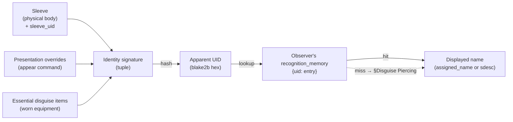
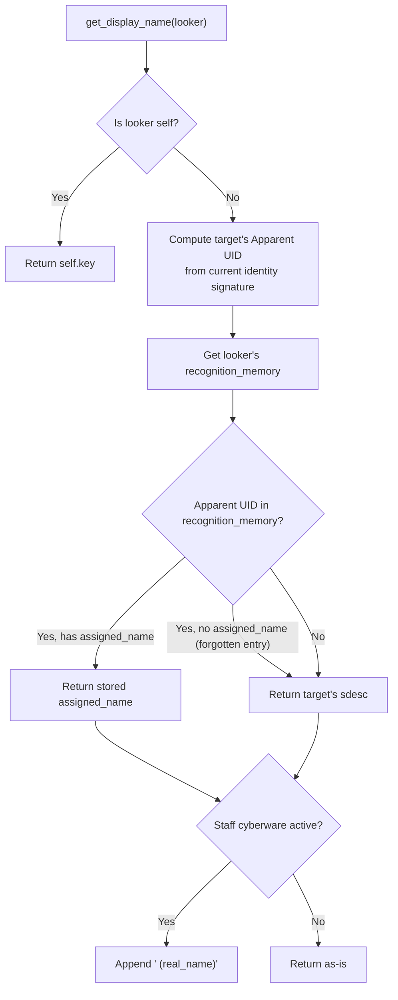
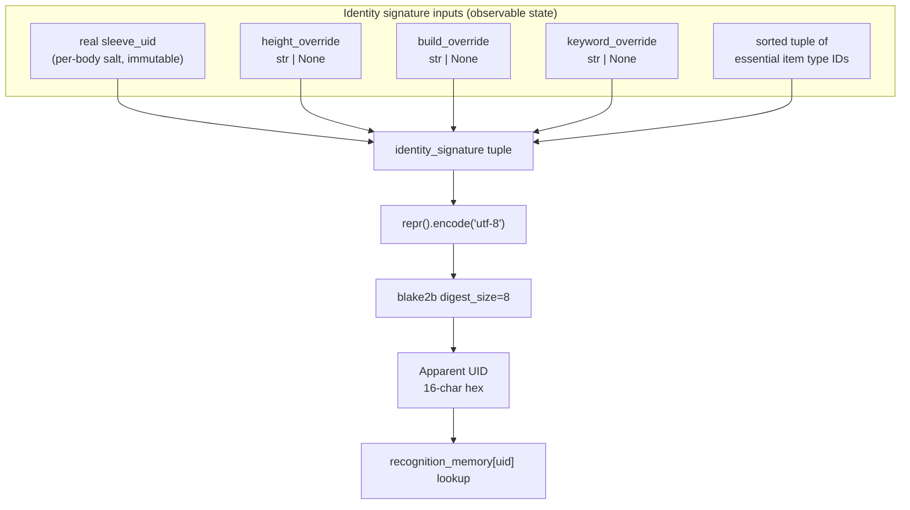
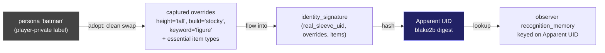
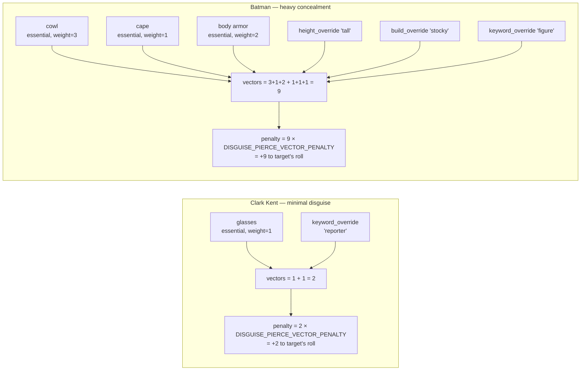
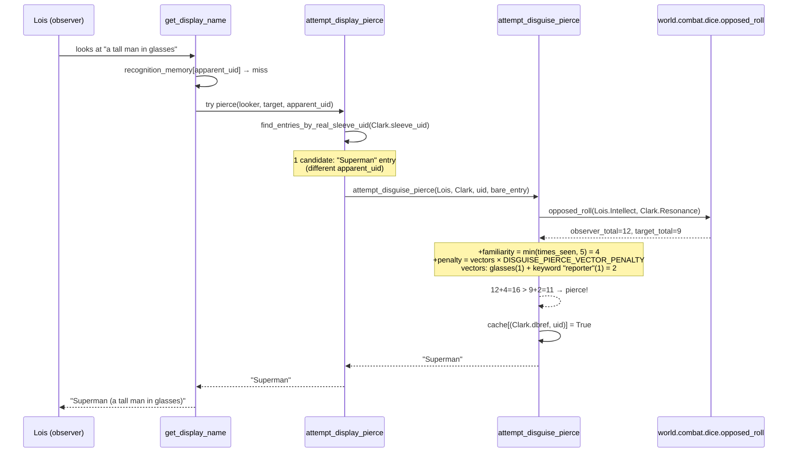

# Identity & Recognition System Specification

## Overview

Characters in Gelatinous are currently identified everywhere by their `key` (real name). This spec introduces a **sleeve-based recognition system** where characters see strangers by physical description, manually assign names, and store recognition in organic memory (the brain organ). The system is designed so cybernetic memory (cyberbrain, digital ID) can plug in seamlessly later.

This is foundational infrastructure. Identity and recognition form the backbone of future **memory**, **forensics**, **social deception**, **communication**, and **posing** systems. Every NPC is a full participant — all Characters have brains with recognition memory.

### Design Principles

1. **Physical identity** — Recognition is based on the physical sleeve (body), not consciousness. Same body = same recognition across clones.
2. **Unique by default** — The sdesc system uses enough physical traits and visible state to make characters distinguishable most of the time without effort.
3. **Obscurable with effort** — Characters can obscure their identity, but only if they're meticulous. Half-measures leave tells.
4. **Per-observer truth** — Every character in a room may know other characters by different names. Messages must render per-observer.
5. **RAG-ready memory** — Recognition entries are rich documents with temporal, spatial, and contextual metadata, designed for future retrieval-augmented generation.
6. **Generic grammar** — The grammar engine serves identity now and the posing system later. Built generic from day one. See `EMOTE_POSE_SPEC.md` for the canonical grammar engine specification.

---

## Core Concepts

### Sleeve

A physical body. Each sleeve has inherent, observable physical traits (height, build, sex) and a unique `sleeve_uid` (UUID). Flash clones are physically identical and inherit the same `sleeve_uid`. A sleeve's identity is what others see — not what consciousness inhabits it.

### Short Description (sdesc)

What strangers see instead of a name. Composed from observable physical traits:

```
"a {physical_descriptor} {keyword} {distinguishing_feature}"
```

- **Physical descriptor** — auto-derived from height × build (immutable without a new sleeve)
- **Keyword** — player-selected via `@shortdesc`, gender-gated
- **Distinguishing feature** — auto-derived from visible state: clothing > hair > nothing

Skintone is deliberately excluded from the sdesc. It appears only in the longdesc when someone `look`s at the character directly.

### Recognition

A per-character memory mapping (currently stored as an `AttributeProperty` on the Character; brain-organ storage deferred — see §Memory Architecture): "I know the person with this Apparent UID as [name], and here's everything I remember about them." When you see someone whose current Apparent UID is in your memory, you see the name you assigned. When you don't recognize them, you see their sdesc. Because the Apparent UID is derived from the target's full identity signature (real sleeve, active overrides, essential items), the same physical body can produce different recognition entries under different disguises — see §Memory Data Model.

### Apparent Identity

What the recognition pipeline actually resolves against. Three distinct concepts work together:

1. **Identity Signature** — a tuple of all observable identity inputs: real `sleeve_uid` (the body's salt), active presentation overrides (height, build, keyword), and the sorted set of equipped essential disguise item types. The signature is recomputed on access from current state.
2. **Apparent UID** — a deterministic 16-character hex digest of the identity signature (`blake2b(signature_bytes, digest_size=8).hexdigest()`). This is the **key** that recognition memory is stored under. Same signature → same UID → auto-recognition; any signature change → new UID → observers see a stranger.
3. **Persona** — a player-private label for a remembered combination of overrides. Personas do **not** generate UIDs themselves; they are pure recall ergonomics. Adopting a persona restores its captured overrides, which then flow through the signature → UID pipeline like any other state.

The sdesc is overridable through `appear`, but the distinguishing feature always reflects actual visible state — true disguise requires changing your clothes (or destroying / acquiring essential items).

**The full pipeline at a glance.**



> **Worked example — Bruce Wayne, two signatures, one observer.** Alfred has been with Bruce for decades; his `recognition_memory` holds two entries for the same `sleeve_uid`:
>
> - Entry A: Apparent UID for *bare Bruce* (no overrides, no essential items) → `assigned_name = "Bruce"`.
> - Entry B: Apparent UID for *Batman* (height='tall', build='stocky', keyword='figure' + cowl/cape/armor) → `assigned_name = "Batman"`, `linked_to = <Entry A uid>` (cell D from a prior unmasking moment).
>
> When Bruce walks into the Batcave in a tux, `get_display_name(Alfred)` hashes the bare signature, hits Entry A, returns `"Bruce"`. When he steps out in the suit, the same code hashes the costumed signature, hits Entry B, returns `"Batman"`. Alfred's `recall` surfaces "Batman, also known as Bruce" via `get_linked_aliases`. A stranger watching the same scene sees `"a tall figure in dark armor"` either way — no entries in their memory, no linkage, the sdesc renderer takes over.

---

## Short Description (sdesc) System

### Composition

The sdesc is assembled from three components:

```
article + physical_descriptor + keyword + distinguishing_feature
```

Examples:
- `"a lanky man in a leather jacket"`
- `"a compact woman with blonde braids"`
- `"a heavyset droog in red power armor"`
- `"a diminutive kid"`
- `"an athletic dame with cropped white hair"`
- `"a towering bloke in a torn lab coat"`

The article (`a` / `an`) is determined by the grammar engine based on the first phoneme of the physical descriptor.

### Physical Descriptor Table

Derived from the cross-product of height and build. Players select height and build at character creation; the descriptor is auto-derived and cannot be directly set.

**Heights**: short, below-average, average, above-average, tall
**Builds**: slight, lean, athletic, average, stocky, heavyset

| | slight | lean | athletic | average | stocky | heavyset |
|---|---|---|---|---|---|---|
| **short** | diminutive | wiry | compact | short | squat | rotund |
| **below-avg** | slight | lithe | spry | unassuming | stout | portly |
| **average** | slender | lean | athletic | average | stocky | heavyset |
| **above-avg** | willowy | rangy | strapping | tall | brawny | hulking |
| **tall** | lanky | gaunt | towering | tall | burly | massive |

30 unique descriptors. These are setting-neutral and describe observable silhouette.

### Keyword List

Players select their keyword via `@shortdesc`. Keywords are gender-gated: feminine-presenting and gender-neutral keywords are available to female characters, masculine-presenting and gender-neutral to male characters. The `appear` command allows selecting **any keyword from the full catalog** regardless of the character's gender — a male character can disguise as a "woman" and vice versa. This is available to all characters, not restricted by access level.

**Feminine-presenting (24):**
female, girl, lass, woman, matron, grandma, hag, granny, madam, tomboy, chick, gal, chica, vixen, diva, dame, sheila, mona, bimbo, bitch, lady, senorita, chola, devotchka

**Masculine-presenting (23):**
male, boy, lad, man, patron, grandpa, geezer, gramps, gentleman, guy, fellow, dude, playa, pimp, bloke, bruce, mano, bro, douche, stiff, hombre, cholo, droog

**Gender-neutral (24):**
person, kid, urchin, human, citizen, elder, fossil, fleshbag, denizen, neut, snack, walker, chum, charmer, star, mate, smoker, meatsicle, punk, clone, wageslave, baka, androog, suit

### Distinguishing Feature Derivation

The distinguishing feature is the final clause of the sdesc. It is **always auto-derived** from the character's actual visible state — players cannot set it directly. This ensures the sdesc is always truthful to what observers can actually see.

**Priority order:** clothing > hair > nothing

#### Clothing-based Feature

The system selects the most visually prominent worn item. Prominence is determined by:
1. Outermost layer (what's on top)
2. Largest coverage area (full-body > torso > head > extremities)
3. If multiple items tie, the most recently equipped takes precedence

Format: `"in {article} {item_sdesc}"` — e.g., `"in a leather jacket"`, `"in red power armor"`, `"in a tattered lab coat"`

Items use a `worn_sdesc_short` attribute for this clause — a brief, recognizable noun phrase. When unset, the selector falls back to the item's `key`.

**Disguise items are deprioritised.** When a wearer has any non-disguise clothing, the feature selector partitions the worn items and prefers the non-disguise pool. The disguise pool is consulted only when nothing else is worn — the *naked-but-masked* carve-out. Without this carve-out, a lone balaclava would yield no feature clause; with it, observers still get `"a tall lean masked droog in a black balaclava"`. When real clothing is added, the feature shifts to that clothing and the balaclava's contribution falls back to the disguise adjective only (see [Disguise Adjective](#disguise-adjective)): `"a tall lean masked droog in a black trenchcoat"`.

#### Hair-based Feature

If no clothing provides a distinguishing feature (nude, very minimal clothing), the system falls back to hair.

Format: `"with {color} {style}"` — e.g., `"with red dreadlocks"`, `"with cropped white hair"`, `"with long black braids"`

If the character is bald or has no hair attribute set, this is skipped.

Head coverings suppress the hair fallback by setting `covers_hair = True` on the item; under coverage the chain falls through to "no feature" rather than describing hair the observer cannot see. Scope is feature-fallback only — longdesc gating lives with the existing clothing-coverage code.

#### No Feature

If the character has no visible clothing and no visible hair (bald + nude, or fully concealed), the sdesc has no distinguishing feature clause:

```
"a lanky man"
"a compact woman"
```

This makes the character harder to distinguish — which is realistic.

### Hair Attributes

Two new attributes selected at character creation:

- **`db.hair_color`** — e.g., "red", "black", "blonde", "white", "brown", "gray", "blue", "green", "pink", "purple", "silver", "auburn" (or None/bald)
- **`db.hair_style`** — e.g., "cropped", "short", "long", "braided", "dreaded", "mohawk", "ponytail", "shaved sides", "curly", "straight", "matted", "slicked" (or None/bald)

Combined for display: `"{hair_color} {hair_style} hair"` → `"red dreaded hair"` or shorthand like `"red dreadlocks"`. The exact phrasing can use a small mapping table for natural-sounding combinations (e.g., "dreaded" + color → `"{color} dreadlocks"`).

### `@shortdesc` Command

```
@shortdesc <keyword>
```

Changes the player's keyword component only. Validates against the gender-gated keyword list. The physical descriptor and distinguishing feature cannot be set this way — they reflect reality.

```
> @shortdesc droog
You will now appear as "a lanky droog in a leather jacket" to those who don't know you.
```

---

## Recognition System

### Recognition Pipeline



Self-perception (`"You"`) is **not** returned by `get_display_name`; it is handled at the rendering layer (see §Self-Perception below).

### `get_display_name` Override

The central hook. Currently returns `self.key` (Evennia default). Overridden on Character:

```python
def get_display_name(self, looker, **kwargs):
    """Return identity-aware display name based on looker's recognition."""
    if looker == self:
        return self.key  # Self-perception handled at render layer

    # Compute current Apparent UID from identity signature
    apparent_uid = self.get_apparent_uid()

    # Check looker's recognition memory (keyed on Apparent UID)
    recognized_name = looker.recall_name(apparent_uid)

    if recognized_name:
        display = recognized_name
    else:
        display = self.get_sdesc()

    # Staff cyberware overlay
    if looker.has_identity_overlay():
        display = f"{display} [{self.key}]"

    return display
```

### Memory Data Model

Each recognition entry is a rich document, designed for future RAG integration. Entries are **keyed on Apparent UID** (the 16-character hex digest of the target's identity signature at the moment of remembering), not on real `sleeve_uid`. This means a single real character may appear under multiple recognition entries — one per distinct disguise signature the observer has tagged.

```python
recognition_memory = {
    "<apparent_uid>": {              # 16-char hex digest of identity signature
        # Core identity
        "assigned_name": str | None,    # What the rememberer calls them
                                        # (None means entry exists but has been forgotten)

        # Temporal context
        "first_seen": str,              # ISO timestamp of first encounter
        "last_seen": str,               # ISO timestamp of most recent perception.
                                        # Bumped passively on room entry (see
                                        # §Memory Architecture) and on every
                                        # explicit `remember`. Throttled to one
                                        # write per RECOGNITION_BUMP_THROTTLE_SECONDS
                                        # per UID per observer.
        "times_seen": int,              # Count of explicit `remember` invocations
                                        # for this entry. Does NOT track passive
                                        # perception — see `last_seen` for recency.

        # Spatial context
        "location_first_seen": str,     # Room name/key where first encountered
        "location_last_seen": str,      # Room name/key where last perceived
                                        # (passive bump on room entry + explicit `remember`)
        "locations_seen": [str],        # All locations where encountered

        # Appearance snapshot
        "sdesc_at_first_encounter": str,  # What they looked like initially
        "sdesc_at_last_encounter": str,   # What they looked like most recently
                                          # (passive bump on room entry + explicit `remember`)

        # Player-authored
        "notes": str,                   # Free-text notes (player-written)
        "tags": [str],                  # Player-assigned tags ("dangerous", "merchant", "ally")

        # System-derived
        "confidence": float,            # 0.0-1.0, Resonance-influenced recognition certainty
        "relationship_valence": str,    # "hostile", "neutral", "friendly", "unknown"
        "lost_contact": bool,           # True once the entry's UID has not matched any
                                        # observable character for an extended period,
                                        # OR once the observer witnessed the presentation
                                        # transition into a new signature ("unmasking").
                                        # Entry remains visible in `memory` and `recall`
                                        # but is annotated as out of contact.
        "real_sleeve_uid": str | None,  # The target's actual `sleeve_uid` at the
                                        # moment of writing. Written once per entry
                                        # (sleeves don't change) and lazily backfilled
                                        # by `bump_recognition_recency` and the
                                        # unmasking-moments hook when missing. Enables
                                        # `find_entries_by_real_sleeve_uid` reverse
                                        # lookup used by the disguise-piercing
                                        # recognition roll (see §Disguise Piercing).
        "linked_to": str | None,        # Apparent UID of a prior presentation the
                                        # observer witnessed transitioning into this one.
                                        # Populated by the unmasking-moments hook (see
                                        # §Unmasking Moments). Forms a one-direction
                                        # chain new → old; walked by
                                        # `get_linked_aliases` to render the
                                        # "Also known as" line in `recall` and the
                                        # "(aka ...)" annotation in `memory`.

        # Interaction log (capped, rolling window)
        "recent_interactions": [
            {
                "timestamp": str,       # ISO timestamp
                "location": str,        # Where it happened
                "type": str,            # "combat", "trade", "conversation", "observation"
                "summary": str,         # Brief auto-generated description
            }
        ],
    }
}
```

This is stored as a db attribute on the Character (`recognition_memory` AttributeProperty), keyed by **Apparent UID**. See §Memory Architecture for the storage-location rationale and the planned migration to brain-organ storage. The `recent_interactions` list should be capped (e.g., last 20 interactions per entry) to prevent unbounded growth, with older interactions eligible for summarization or archival.

**Orphaned entries (`lost_contact`):** A recognition entry whose Apparent UID has not matched any observable character within a configurable window (deferred to balance pass; provisional default: 30 in-game days, defined as `LOST_CONTACT_THRESHOLD_SECONDS` in `world/identity.py`) is marked `lost_contact = True`. The entry stays visible in `memory` and `recall` (player-authored notes are valuable lore even when the trail goes cold) and is rendered with a "(lost contact)" annotation. The flag has **two writers**:

1. **Lazy staleness scan** — `world/identity.py:mark_lost_contact_entries`, invoked from the `memory` and `recall` commands via `commands/CmdCharacter._refresh_lost_contact` immediately before iterating recognition memory. No background scan; the flag only updates when a surface would render it.
2. **Unmasking-moments hook** — `world/identity.py:_broadcast_unmasking` (cells B and D of the broadcast matrix, see §Unmasking Moments) flips the *old* entry's `lost_contact` to `True` synchronously when an observer witnesses a signature change. This is an eyewitness fact, not an inference: the prior presentation is provably gone from this sleeve.

The flag therefore carries a mild dual semantic — "this presentation hasn't been observed in a long time" *or* "this presentation was directly observed to transition away." Both render the same `|y(lost contact)|n` annotation; the player-facing string is intentionally agnostic.

The inverse — clearing the flag back to `False` on re-meet — is handled by `world/identity.py:bump_recognition_recency` (passive perception path), by the recognition writer in `_remember_target` (explicit `remember` path), and by cells C and D of the unmasking broadcast (refreshing the new entry). A future player command may allow explicit pruning of lost-contact entries; auto-pruning is intentionally **not** done.

**Passive recency on perception:** Recency fields on existing recognition entries (`last_seen`, `location_last_seen`, `sdesc_at_last_encounter`) are refreshed without an explicit `remember` whenever the observer perceives a target whose Apparent UID is already in their memory. This is implemented by `world/identity.py:bump_recognition_recency`, invoked from `Character.at_post_move` via `_refresh_recognition_recency`: on every room entry the observer scans the new room's contents and bumps each known UID. Writes are throttled to one bump per `RECOGNITION_BUMP_THROTTLE_SECONDS` (provisional 300s = 5 minutes) per UID per observer, so extended co-location does not spam AttributeProperty writes. The helper is **strictly opt-in for already-remembered UIDs** — it never creates entries; entry creation remains the exclusive responsibility of the `remember` command. The `times_seen` counter is intentionally **not** incremented by passive perception; it counts explicit `remember` invocations only. Stealth/sneaking/hidden mechanics are a known future delta — when those land, they will need to suppress this hook for hidden targets.

### Remembering Names

**`remember` command:**

```
remember <target> as <name>
```

Stores the name in the rememberer's recognition memory under the target's current **Apparent UID**. Any name is valid — false names are always possible. Re-remembering overwrites. Names are validated against the cross-namespace uniqueness rule (see §Personas — *Cross-namespace uniqueness*): the assigned name must not collide with the keyword catalog, the caller's persona names, or any existing recognition `assigned_name` on a different Apparent UID.

```
> remember tall man as Jorge
You will now recognize a tall lanky man as Jorge.

> remember 2nd lanky dude as Sketchy Pete
You will now recognize a lanky man with a leather jacket as Sketchy Pete.
```

If the target is already remembered under a different name:

```
> remember Jorge as Johnny Twoshoes
You now know Jorge (previously 'Jorge') as Johnny Twoshoes.
```

**`forget` command:**

```
forget <target>
```

Clears the assigned name on a recognition entry. The entry itself is preserved (sdesc snapshots, locations, `times_seen`, etc.) so future `remember` calls extend the existing history rather than starting fresh. Targets resolve against currently-visible characters first, then against previously-remembered names — you can `forget` someone who isn't present.

**`recall` command:**

```
recall <target>
```

Inspects a single recognition entry: assigned name (if any), what they looked like at first encounter, where, when, and how many times you've seen them. Same target resolution as `forget`.

**`memory` command:**

```
memory
```

Lists every person you've remembered by name, sorted by recency (most recently seen first). Forgotten entries are not listed even though their record is preserved.

**Digital ID exchange (Phase 4 — Cybernetics):**

A character with a cyberbrain can broadcast their digital identity over the air. The receiver's cyberbrain auto-stores the transmitted name and sleeve_uid. This is a certificate-exchange model — fast, impersonal, verifiable within the digital trust framework.

Socially, demanding someone flash their digital ID is a faux pas in most contexts — it implies distrust. This is a social norm enforced by player culture, not game mechanics.

---

## Memory Architecture

### Organic Memory (Character AttributeProperty)

Recognition data lives directly on the Character as an `AttributeProperty` (`typeclasses/characters.py`: `recognition_memory`). The original design located this on the brain organ — that pivot was deferred to keep the engine PR scoped, but the storage location is conceptually still "the character's organic memory" and the migration to brain-organ storage remains tracked under the medical-system rework.

**Storage:** `Character.recognition_memory` (dict, AttributeProperty), keyed by **Apparent UID**.

**Properties:**
- Populated by explicit player action (`remember` command)
- Future: auto-populated by Resonance-driven proximity detection
- Lost on character deletion. When recognition migrates to the brain organ (future medical-system work), it will be lost on brain destruction — moot for the current character (brain destruction = death) but relevant for brain-transplant scenarios.
- Brain damage (non-fatal, future) will carry a risk of partial memory loss — individual entries can be degraded or lost. This is a future enhancement once the memory pool is rich enough to make partial loss meaningful and once recognition lives on the brain organ.
- Flash clones get a new Character record — they start with empty recognition memory. The clone is a stranger who happens to look like someone others remember.

> **Implementation note (engine PR rollout):** The engine PR ships recognition storage on the `Character` typeclass as an `AttributeProperty`, not on the brain organ. Migration to brain-organ storage is a follow-up tracked alongside the medical-system rework. All consumers in this spec that read or write "the brain's recognition memory" should be understood to mean "the character's `recognition_memory` AttributeProperty" until that migration lands. The data shape and semantics are unchanged.

### Digital Memory (Cyberbrain — Phase 4)

Same data model as organic memory, different storage and capabilities:

- Stored on the cyberbrain implant (future cyberware system)
- Backed up, transferable between sleeves
- Hackable, forgeable, wipeable
- Provides a contact-book UI (traditional list interface)
- Survives resleeving if the cyberbrain is preserved or backed up

**Lookup priority:** Cyberbrain first, then organic brain. First match wins. This means a character with both memory types has redundant recognition — harder to fool.

### Memory and Resonance

Resonance ("Social Connection & Empathy", currently 0 mechanical uses) becomes the governing stat for organic memory:

- **Memory persistence** — Higher Resonance → organic memories persist indefinitely. Low Resonance → risk of memory decay over time (entries lose confidence, eventually drop out).
- **Auto-recognition** — Future: at high Resonance, spending extended time in proximity with someone can auto-populate a recognition entry (you develop an intuitive sense of who they are without formal introduction).
- **Disguise perception** — **Shipped.** Disguise piercing uses an opposed Intellect (observer) vs Resonance (target) roll with a familiarity bonus capped at `DISGUISE_PIERCE_FAMILIARITY_CAP` and a per-vector penalty of `DISGUISE_PIERCE_VECTOR_PENALTY` (worn `disguise_essential` items + active overrides). See the [Disguise Piercing](#disguise-piercing) section for the full contract.
- **Confidence** — The `confidence` field in memory entries is influenced by Resonance. Higher confidence means the name displays with certainty; at low confidence, the display could show uncertainty: `"Jorge(?)"` or `"someone who might be Jorge"`.

Exact thresholds and formulas are a tuning concern — the architecture supports Resonance as an input to all these systems.

---

## Grammar Engine

The grammar engine handles article selection, possessive forms, objective forms, and pronoun integration for sdescs and character names. It is designed generically to serve the identity system now and the **posing system** in the future. The canonical grammar engine specification — including verb conjugation rules, the `inflect` integration for articles, and pronoun transformation tables — lives in `EMOTE_POSE_SPEC.md`. This section covers the identity-specific requirements.

### Article Handling

Sdescs always include a grammatically correct article:

- **Indefinite** (default for sdescs): `"a tall man"`, `"an athletic dame"`
- **Definite** (for targeting / objective references): `"the tall man"`, `"the athletic dame"`
- `a` vs `an` determined by phoneme of the following word, not just the letter (e.g., `"an unassuming"` not `"a unassuming"`)

### Possessive Forms

For sdescs:
- `"a tall man's knife"` → article + descriptor + keyword + `'s`
- `"Jorge's knife"` → recognized name + `'s`

For pronouns (self-perception):
- `"your knife"` (when looker is the possessor)

### Objective Forms

When a character is the object of an action:
- `"You attack the tall man."` — definite article for the target
- `"A lanky droog attacks you."` — "you" for self

### Pronoun Integration

The grammar engine interoperates with the existing pronoun system. Template variables like `{they}`, `{them}`, `{their}` resolve based on the character's **apparent gender** — the result of `get_apparent_gender(char)` (see §Pronouns Under Disguise). For an undisguised character this matches `caller.gender`; for a disguised character it derives from the active `keyword_override`. Recognition (i.e. having a name tagged on the observed Apparent UID) changes the *name* observers see, but does not alter the pronoun set; pronouns are a function of the *current* apparent presentation, not of the recognition tag.

### Self-Perception

When `looker == self`:
- `get_display_name(self)` → `self.key` (the character's own real name)
- Self-perception "You" is **not** returned by `get_display_name` — it is handled by the communication/rendering layer (dot-pose, say, whisper, system messages)
- This avoids breaking third-person sentence construction ("You is standing here")
- See `EMOTE_POSE_SPEC.md` Appendix C for the full architectural rationale

### Future: Posing System

The grammar engine is built as a standalone utility module (`world/grammar.py`) that can be imported anywhere. The full posing and communication system — including the dot-pose command, verb conjugation, pronoun transformation, per-observer emote rendering, and custom say/whisper overrides — is specified in `EMOTE_POSE_SPEC.md`.

Example of the grammar engine in action with the posing system:

```
> pose picks up {their} knife and stares at {target}.

Observer who knows both:
→ "Jorge picks up his knife and stares at Maria."

Observer who knows neither:
→ "A lanky man picks up his knife and stares at a compact woman."

Self:
→ "You pick up your knife and stare at a compact woman."
```

The grammar engine must handle:
- Arbitrary noun phrase inflection (articles, possessives, objective case)
- Subject-verb agreement (`"a tall man picks"` vs `"you pick"`)
- Pronoun resolution from character gender
- Definite/indefinite article context (first mention = indefinite, subsequent = definite)

---

## Disguise System

Disguise is a **continuous performance** — a character is always being perceived as whatever combination of presentation overrides and worn items currently apply. There is no "starting" or "stopping" a disguise; identity flows organically from observable state. The system is available to **all characters**.

### Three Architectural Layers

Disguise has three independent layers, each controllable on its own and combining to form the final observable identity:

| Layer | Controlled by | What it affects |
|-------|--------------|-----------------|
| **Presentation overrides** | `appear` command | Per-axis: height, build, keyword, (future) voice |
| **Disguise items** | Equipping/removing tagged clothing | Distinguishing feature + identity signature (when essential) |
| **Body modification** (future) | Pharmaceuticals / cybernetics | `@longdesc` + identity signature |

The **sdesc** is always composed the same way regardless of disguise state:

```
"{physical_descriptor} {keyword} {distinguishing_feature}"
```

- Presentation overrides change the components going into descriptor and keyword
- Items contribute to the distinguishing feature via the existing auto-derivation system (essential items additionally contribute to the identity signature)
- The layers combine into the full observable identity

### Identity Signature & Apparent UID

The recognition system needs a stable identifier for "this disguised person" so observers can tag and re-recognize them across encounters. This identifier is the **Apparent UID**, derived deterministically from an **identity signature** computed from:

1. The character's **real `sleeve_uid`** (acts as a per-character salt — the body's bones, gait, mannerisms, and bearing are part of how the character is perceived)
2. The character's **active presentation overrides** (height, build, keyword)
3. The set of **essential disguise items** currently equipped (by item type, not specific instance)

```python
identity_signature = (
    real_sleeve_uid,            # str (UUID)
    height_override or None,    # str | None — None when no override
    build_override or None,     # str | None
    keyword_override or None,   # str | None
    tuple(sorted(essential_item_type_ids)),  # tuple[str, ...] — stable order
)

signature_bytes = repr(identity_signature).encode("utf-8")
apparent_uid = hashlib.blake2b(signature_bytes, digest_size=8).hexdigest()
# 16-character lowercase hex string, e.g. "a3f1c92b08e4d7f6"
```

**Signature anatomy.**



> **Worked example — Peter Parker, two presentations.**
>
> | Input | Bare Peter | Spider-Man |
> |---|---|---|
> | `real_sleeve_uid` | `peter-uuid` | `peter-uuid` (same — same body) |
> | `height_override` | `None` | `None` |
> | `build_override` | `None` | `None` |
> | `keyword_override` | `None` | `"vigilante"` |
> | essential item types | `()` | `("mask-red", "suit-spandex")` |
> | identity_signature | `("peter-uuid", None, None, None, ())` | `("peter-uuid", None, None, "vigilante", ("mask-red","suit-spandex"))` |
> | Apparent UID | `4f2c…a901` | `8b13…7e6d` *(different)* |
>
> Same body, two distinct UIDs — observers tag each independently. The salt (`peter-uuid`) being shared is what later lets the §Disguise Piercing path correlate the two: a familiar observer can pierce *from* the Spider-Man UID *to* the Peter entry because both rows in their `recognition_memory` carry the same `real_sleeve_uid`.

**Hash choice rationale:** `blake2b` with `digest_size=8` is fast, deterministic across processes (unlike Python's builtin `hash()`, which is salted per-process via `PYTHONHASHSEED`), and produces a 16-character hex digest with a 64-bit collision space — comfortable for the per-observer recognition-memory dict, where collisions only matter within a single character's memory and population is bounded by encounter count.

**Key properties:**

- Same character + same overrides + same essential items → **same Apparent UID, every time.** Observers who tagged this combination before will auto-recognize it again. This is the *organic recurring identity* property.
- Change any signature input → **different Apparent UID.** Observers who tagged the prior signature see a stranger. This is the *unmasking* property.
- Two different characters wearing the same overrides + items → **different Apparent UIDs** (different salt). Visual collision but no recognition collision. Impersonation is *visual*, not *systemic*.
- Items reference by **type**, not instance. Replacing a destroyed balaclava with another balaclava of the same type preserves the signature. The exact "type ID" representation is defined by the disguise-item taxonomy in Phase 3.5; the engine consumes a sorted tuple of stable string identifiers.

**Tradecraft as gameplay:**

Because the signature emerges from observable state — not from a player declaration — disguise discipline becomes a real player skill. Always wearing the same balaclava? Always overriding to the same height? Frequenting the same locations in the same look? A persistent observer with a good memory builds a recognition tag on that signature, and a "secret" identity becomes trackable. Mixing up overrides, varying essential items, and avoiding repetition is how a character stays anonymous. **Bad tradecraft is mechanically punished; good tradecraft is mechanically rewarded.**

### `appear` Command — Presentation Overrides

The `appear` command is the player's interface to presentation overrides. Each override is a **per-axis** change applied independently:

```
appear taller / shorter                     — height axis (one step on the HEIGHTS scale)
appear bulkier / fatter                     — build axis, one step heavier
appear thinner / leaner                     — build axis, one step lighter
appear <keyword>                            — keyword axis (full catalog, gender filter
                                              bypassed)
appear <persona name>                       — adopt a saved persona (clean swap)
appear                                       — show current overrides + active persona
stop appearing                               — clear all overrides + active-persona pointer
```

Axis-step verbs refuse at the extremes (an unreachable axis value is itself a tell). The canonical clear verb is `stop appearing`; there is no `appear reset` alias.

Each override is conceptually a **skill-based performance** — using the `appear` verb is intended to trigger a Resonance check for that axis. In the foundation cut, no check is implemented; every axis override succeeds unconditionally. The Resonance check call point will be added alongside Phase 5 perception mechanics, when there is a real consumer (per-axis difficulty modeling, opposed-roll tuning) to justify the wiring. Per-axis difficulty modeling is deferred.

The composed sdesc descriptor (`gaunt`, `burly`, etc.) is recomputed from the overridden height + build values via the existing `get_physical_descriptor(height, build)` table. Players override the **components**; the system composes the descriptor.

**What `appear` overrides change:**
- The signature inputs for the affected axes
- The composed sdesc descriptor and/or keyword visible to observers
- The Apparent UID (since signature inputs changed)
- The full keyword catalog is available regardless of the character's real gender

**What `appear` does NOT change:**
- Distinguishing feature (auto-derived from worn items + hair)
- `@longdesc` (looking directly reveals real physical detail until body-mod layers exist)
- Voice (deferred to future communication-system integration)
- The character's real `sleeve_uid` (the underlying body identity)

### Pronouns Under Disguise

Pronouns must follow the disguise. A character presenting as "a woman" should be referenced with feminine pronouns by observers who do not know the real identity, regardless of the disguiser's underlying `sex` attribute. Failing to do so is an immediate identity tell and a defect of the rendering layer.

**Derivation rule:**

1. If the character has an active `keyword_override`, look the override up in the runtime keyword catalog (`KeywordManager` script's `db.feminine_keywords` / `db.masculine_keywords` / `db.neutral_keywords`, falling back to the `_DEFAULT_FEMININE_KEYWORDS` / `_DEFAULT_MASCULINE_KEYWORDS` / `_DEFAULT_NEUTRAL_KEYWORDS` frozensets in `world/identity.py` when the script is unavailable).
   - Match in the feminine list → render as `she/her/hers`.
   - Match in the masculine list → render as `he/him/his`.
   - Match in the neutral list, **or no match anywhere** (e.g. a custom `@shortdesc` keyword such as `ronin` or `wraith`, which carries no gender metadata in `KeywordEvent`) → render as `they/them/theirs` (singular they).
2. If the character has **no** active `keyword_override`, pronouns derive from the character's real `gender` property as today (no behavior change for undisguised characters).

**Implementation surface (engine PR):**

A single helper, conceptually `get_apparent_gender(char)`, returns one of `"male" | "female" | "neutral"` and is the only function that consumers (`world/emote.py`, `world/grammar.py`'s `transform_pronoun()`, longdesc/sdesc renderers, social templates) call to determine pronouns. The existing `caller.gender` reads inside emote / pose / template paths are redirected through this helper. The helper internally consults the keyword catalog and falls through to `caller.gender` only when no override is active.

**No explicit `gender_override` axis in Phase 3.** Derivation is sufficient: a player who wants to be referred to with a different pronoun set picks a keyword from the desired gender list (the full catalog is available via `appear <keyword>`, gender filter bypassed). An explicit override axis is noted in Future Hooks for the case where a player wants a custom keyword *and* a non-neutral pronoun set.

**Custom-keyword consequence:** Keywords minted via `@shortdesc` (logged as `KeywordEvent` rows) have no gender field on the model. They will always render neutral under this rule. This is acceptable — custom keywords are deliberately ambiguous, and forcing the player to also pick from the gendered catalog if they want gendered pronouns matches the deliberate-tradecraft theme of the system.

### Personas — Player-Facing Persona Recall

Because the identity engine is purely emergent from current state, players need an ergonomic layer to **remember and restore** disguise combinations they have discovered and want to reuse. Personas fill this role.

A persona is a **player-private snapshot** of presentation overrides, captured at the moment of saving and restorable later. Personas are designed in parallel to the planned identity/contact system — same recall, annotation, and (future) web-UI patterns.

> **Status:** The surface verbs (`appear`, `stop appearing`, `personas`, `persona`, `remember me as <name>`, `forget <persona>`), the persona storage schema, the signature engine, Apparent UID derivation, `get_sdesc()` consumption of overrides, pronoun derivation under disguise via `get_apparent_gender`, recognition-memory keying on Apparent UID, the persona `essential_item_types` snapshot + adoption-time advisory, the `lost_contact` orphan-marking flag with its `memory` / `recall` render annotation, the unmasking-moments hook (`apply_signature_change` + `_broadcast_unmasking` + `linked_to` chains + "Also known as" / "(aka ...)" rendering — see §Unmasking Moments), and corpse apparent-UID propagation are all **shipped**.

**A persona stores:**
- A **player-chosen name** (case-insensitive lookup, case-preserving display, player-private — never visible to other characters)
- The **override values** active at save time (height, build, keyword) — `None` for axes that were unset
- The **types of essential disguise items** equipped at save time, captured via `get_essential_item_type_ids()` (sorted, deduplicated)
- A **freeform notes field** for player annotations *(reserved field, currently always empty)*
- A **created-at timestamp** and the **room name** where it was saved

**Pronouns are not stored separately.** Restoring a persona restores its `keyword_override`, and pronouns derive from that keyword via the rule in §Pronouns Under Disguise. A persona that captured a feminine keyword automatically restores feminine pronouns when adopted; a persona that captured a custom keyword automatically restores neutral pronouns. No persona field is needed for gender.

**Personas do NOT generate identities.** They are pure recall aids. When a player adopts a persona, the system applies the captured overrides as a **clean swap** — overwriting all three axes including any unset axes (so adoption produces an exact replay of the saved state, never a merge). The resulting Apparent UID is derived from the restored state, not from the persona itself. Two personas with identical overrides + item-type composition will yield the same Apparent UID — they are just labels in the player's memory.

**Why personas don't carry identity.**



> **Worked example — Bruce's two personas, one batsuit.** Bruce saves `"batman"` (height=tall, build=stocky, keyword=figure, items={cowl, cape, armor}) and `"dark-knight"` with the exact same overrides + items. Adopting either produces the same identity signature, the same Apparent UID, and therefore the same recognition tag on every observer. Alfred sees "Batman" whether Bruce ran `appear batman` or `appear dark-knight` — the label is private to Bruce. Conversely, if Bruce saves `"batman-stealth"` with one item swapped (matte cowl instead of standard cowl), the signature differs, the UID differs, and to Alfred he is a stranger until Alfred re-`remember`s him.

**Adoption-time essential-item advisory.** When the player runs `appear <persona>`, the system diffs the persona's saved `essential_item_types` against the player's currently-equipped essential disguise items and emits a yellow heads-up listing missing and extra type IDs when they diverge. Adoption is **not refused** — the player can choose to proceed and accept the resulting Apparent UID divergence. The advisory exists because unlike real life, it's easy in-game to forget which items pair with which persona; the warning is a recall aid, not a gate. This may be revisited later as the player grows more accustomed to the disguise system.

**Cap:** No cap in the surface PR. The previously-floated `min(Resonance × 2, 10)` gating is held for the engine PR or later balance pass.

**Player surface (current grammar — locked):**
- `appear` — show current overrides + active persona
- `appear taller | shorter` — nudge perceived height one step on the `HEIGHTS` scale; refuses at the extremes (an unreachable axis value is itself a tell)
- `appear thinner | fatter` — same on the `BUILDS` scale
- `appear <keyword>` — present as the given keyword; validated against the full keyword catalog (gender filter does not apply to disguise). New keywords are introduced via `@shortdesc`, not via `appear`.
- `appear <persona name>` — restore a saved persona (clean swap)
- `stop appearing` — clear all overrides and any adopted-persona pointer; the only canonical clear verb (no aliases)
- `remember me as <persona name>` — snapshot current overrides as a persona; allowed even with no axes set (intentional — supports saving a baseline)
- `forget <persona name>` — delete a persona; if it was the currently-adopted persona, also clears all overrides **and** clears `db.active_persona` (the active-persona pointer is invalidated whenever its referent ceases to exist)
- `personas` — list saved personas, recency-sorted (newest first); the active persona, if any, is marked with `*`
- `persona <name>` — inspect a single persona's snapshot

**Resolution order for `appear <arg>`:** persona name → axis nudge keyword (`taller`/`shorter`/`thinner`/`fatter`/`bulkier`/`leaner`) → keyword catalog. Persona names take precedence so a player can always reach their own personas; cross-namespace uniqueness (below) prevents real ambiguity.

**Manual axis change after persona adoption** dissociates the active-persona pointer (with an explicit message) but leaves the persona definition intact. The player can re-adopt it later with `appear <name>`. The `db.active_persona` pointer is also cleared by `stop appearing` and by deleting the active persona via `forget`.

**Cross-namespace uniqueness** is enforced (case-insensitive) when saving a persona name *or* assigning a recognition name via `remember <target> as <name>`. A name is rejected if it collides with:
- the keyword catalog (so `appear <name>` stays unambiguous)
- any of the caller's existing recognition `assigned_name`s (so `forget <name>` stays unambiguous)
- any of the caller's existing persona names

The same rule applies in reverse: assigning a recognition name that collides with a persona name or a catalog keyword is rejected with the offending namespace named in the error message.

### Disguise Items

A disguise item is a clothing/equipment item with two declarative properties:

- **`is_disguise_item`** (`bool`): marks the item as belonging to the disguise taxonomy. Disguise items provide a future Phase 5 perception-roll bonus to the disguiser.
- **`disguise_essential`** (`bool`): marks the item as identity-essential. Essential items contribute to the identity signature (their type is hashed into the Apparent UID); non-essential items contribute only visually through the existing distinguishing-feature derivation.
- **`disguise_weight`** (`int`, default `1`): per-item pierce-penalty weight. When worn (and `disguise_essential = True`), the item counts as this many vectors in the `_count_disguise_vectors` calculation. Heavy concealment (full prosthetic mask, hooded robe) can scale piercing difficulty independently of how many items are involved; `0` lets an essential item pin the identity signature without making piercing harder. Negative values are clamped to `0`; non-numeric values fall back to `1`. No effect on non-essential items.

Examples:
- **Essential**: balaclava, full mask, cowl, wig, contacts, prosthetic face, voice modulator (when voice integration lands)
- **Non-essential**: gloves, scarf, signature jacket, distinguishing hat

The item taxonomy itself (which items exist, their categories, quality tiers) is designed in **Phase 3.5**, a separate cut after the foundation lands. The foundation only needs the two flags to function correctly with zero defined disguise items.

### Disguise Adjective

Disguise items can also flag themselves as a visible **red flag** in the wearer's sdesc through two additional attributes:

- **`disguise_adjective`** (`str`): a single descriptor (`"masked"`, `"hooded"`, `"helmeted"`, …) injected between the physical descriptor and the keyword — e.g., `"a tall lean masked droog"`. Honoured **only** when the same item also has `is_disguise_item = True`; an adjective on a non-disguise item is skipped with a soft warning (red-flag style is reserved for the disguise taxonomy).
- **`covers_hair`** (`bool`): when any worn item declares this, the hair fallback in the distinguishing-feature chain is suppressed. Scope is feature-fallback only; longdesc gating is handled by the existing clothing-coverage code.

Adjective selection is implemented in `world/identity.py:get_disguise_adjective` and consumed by `compose_sdesc`. When more than one adjective is contributed, the wearer's sdesc shows the most identity-defining one. Priority ranks (lowest wins):

| Adjective | Rank |
|---|---|
| `masked` | 1 |
| `helmeted` | 2 |
| `cowled` | 3 |
| `hooded` | 4 |
| `goggled` | 5 |
| `veiled` | 6 |

Adjectives missing from the priority table are admitted at rank 999 with an alphabetical tiebreak — authors can ship new disguise types via item attribute alone, without editing the priority table.

The adjective is **a visual-only red flag** and contributes nothing to the identity signature. Whether the wearer is recognised across encounters is governed entirely by the signature inputs (overrides + essential item type IDs); the adjective only governs how observers describe them. A `masked` wearer who removes the mask and dons an `helmeted` one shifts both adjective and signature simultaneously, but the adjective change alone (e.g., spec-future "rigid mask" item with the same `disguise_type_id` as a balaclava) would not affect recognition.

### Disguise Completeness

A disguise's effectiveness scales with the player's investment:

| Effort | Result |
|---|---|
| Override one axis (`appear taller`) | Subtle change; observers may notice the same person looking different |
| Override all axes (height, build, keyword) | Strong visual difference; recognition tags from prior signature don't apply |
| Add one essential item (e.g., balaclava) | Signature changes; "unmasking" possible if removed |
| Full ensemble (all axes + multiple essentials) | Distinct identity; harder for observers to connect to real you |
| All of the above + change non-essential clothing | Visual distinguishing feature also changes |
| All of the above + body mod (future) | `@longdesc` no longer reveals the truth on close inspection |

**Vector math — how completeness translates into pierce penalty.**



> **Worked example — disguise weight scales effort, not items.** Clark's "disguise" is famously thin: glasses (weight 1) plus a single keyword override. Two vectors, +2 to his Resonance side of the pierce roll. Batman's cowl is heavy concealment — `disguise_weight=3` on the cowl item triples its contribution without inflating the visible item count. Combined with cape, body armor, and a full override sweep, Batman's penalty hits +9. A would-be piercer needs to beat that gap *and* have rolled up familiarity through prior encounters; with `DISGUISE_PIERCE_FAMILIARITY_CAP=5`, even a Robin-grade analyst maxes out a +5 bonus.

### Disguise Persistence

Override and persona state lives in DB attributes — persists across server restarts, reloads, and crashes. There is no "session" concept; a character who logs out mid-disguise logs back in still disguised.

Personas persist indefinitely until explicitly deleted, regardless of whether the character is currently using their overrides.

### Breaking and Degrading Disguise

Because disguise is continuous, "breaking" simply means changing signature inputs.

**Voluntary `stop appearing`:** Clears all overrides and any active-persona pointer. If no essential items are equipped, the Apparent UID returns to the real `sleeve_uid` and observers who know the real identity auto-recognize. If essential items are still equipped, the signature still differs from real — only the override contribution is removed.

**Death:** All active overrides clear; the corpse stores both `real_sleeve_uid` and a snapshot of the identity signature active at time of death (for forensic gameplay — investigators can reconstruct what the character looked like when they died).

**Admin / GM strip:** Staff command clears all overrides on a target. Equipped items are unaffected (use existing strip commands for those).

**Essential item removed (voluntary or forcible):** Signature changes → Apparent UID changes → observers who tagged the prior signature see a stranger. The "unmasking" moment is mechanical: the signature change *is* the reveal. Equipping the same item type again restores the signature and the recognition.

**Essential item destroyed:** Same effect as removal. If a unique-instance item is destroyed, the player must acquire another item *of the same type* to recover the signature. (Hence: items hash by type, not dbref — buying a new balaclava restores the "balaclava-wearing" identity.)

**Non-disguise clothing changes:** Affect distinguishing feature visually but NOT the signature. Putting on or removing a regular jacket doesn't change who the character appears to be in the recognition system; it just changes the description text.

> **Design note:** Direct combat damage (e.g., head wounds) does not break disguise on its own. The disguise system is decoupled from the damage system. Combat affects disguise *indirectly* by destroying or removing essential items.

**The "unmasking" scenario in detail:**

A disguised character (overrides: `tall man` + essential cowl + non-essential cape) is in a room. An observer has tagged this signature as "Batman."

1. Someone rips off the cowl (forcible removal).
2. The signature changes: cowl is no longer in the essential-items set.
3. The Apparent UID recomputes to a new value.
4. The observer's recognition no longer auto-resolves: "Batman" was tagged against the *previous* UID. They now see the new sdesc as a stranger — `"a tall man in a black cape"` — and may deduce the connection from context, but the system does not auto-link the two identities.
5. If the cowl is re-equipped, the signature returns to its prior value and the observer's "Batman" tag fires again.
6. If the disguised character then does `stop appearing`, both overrides and the active-persona pointer are cleared — the Apparent UID returns to the real `sleeve_uid` (or wherever the remaining signature inputs lead, modulo any still-equipped essential items). Observers who knew the real identity may now auto-recognize the character.

### Recognition Interactions

- **Stranger meets disguised character:** Observer sees the disguised sdesc; no auto-recognition. Observer can `remember` them by a name, which binds to the current Apparent UID.
- **Observer who knew real identity meets the disguised character:** The observer's recognition entry was keyed on the Apparent UID of the *undisguised* signature (real `sleeve_uid` + no overrides + no essential items). The disguise produces a *different* Apparent UID; no auto-recognition. The observer sees the disguised sdesc as a stranger.
- **Observer meets the same disguised character a second time, same signature:** Auto-recognition fires (same Apparent UID); observer sees the previously-assigned name.
- **Observer meets the same disguised character a second time, different signature** (e.g., one essential item swapped): Different Apparent UID; observer sees a stranger.
- **Two characters wearing identical overrides + items:** Visual collision (sdesc strings match), but Apparent UIDs differ (different salts). Each observer's recognition is per-UID; impersonation is *visual*, not *systemic*. An impostor *looks* the same but does not auto-resolve to the original's assigned name. Successful name-fooling requires either acquiring the original's salt (future adversarial-identity mechanic — e.g., through stolen contact cards) or the observer manually `remember`ing the same name onto the impostor's distinct UID.
- **Observer meets a previously-tagged disguise that has since been abandoned and never re-presented:** The recognition entry is preserved but its Apparent UID never matches anyone in the room. After a configurable inactivity window (deferred to balance pass), the entry is marked `lost_contact = True` and rendered with a "(lost contact)" annotation in `memory` and `recall`. The entry is never auto-pruned — player notes and lore on the entry remain valuable even when the trail has gone cold.

### Unmasking Moments

When a character's identity signature changes in a populated room, the observers in that room are *eyewitnesses* to the transition. The recognition system captures this synchronously through the **unmasking-moments hook**: a single broadcast pass over the room's conscious observers that updates each observer's recognition memory based on what they already knew about the old and new signatures.

This is the bridge that keeps disguise legible after the fact. Without it, a signature change would silently produce a new stranger UID with no link to the prior presentation — observers would have no in-system way to know that "the masked figure" and "the bareheaded woman" are the same body. With it, observers who watched the change get an explicit linkage (`linked_to`) plus a `lost_contact` flag on the prior presentation, and the "Also known as" rendering surfaces the connection in `recall` and `memory`.

**Implementation surface:**

- **`apply_signature_change`** (`world/identity.py`) — a context manager that wraps any mutation that may change the actor's identity signature. Captures observers + old signature *before* the mutation, then dispatches `_broadcast_unmasking` *after*, but only if the signature actually changed.
- **Wrapped mutation sites:**
  - `commands/CmdCharacter.py`: `_clear_all_overrides` (source `stop_appearing`), `_nudge_height` (`override:height`), `_nudge_build` (`override:build`), `_set_keyword_override` (`override:keyword`), `_adopt_persona` (`persona:<name>`).
  - `typeclasses/clothing_mixin.py`: `wear_item` (`wear_item`) and `remove_item` (`remove_item`) — guarded so the wrap is skipped unless the item has `disguise_essential = True`.
- **Observer collection** — `_collect_unmasking_observers` walks the actor's room, filters to `Character` instances excluding the actor, and drops anyone whose `is_unconscious()` returns truthy (defensive `AttributeError` handling treats failure as conscious).

**Broadcast matrix.** For each observer, the hook evaluates whether the observer's recognition memory contains the old UID, the new UID, both, or neither, and writes accordingly:

| Cell | Observer knew old? | Observer knew new? | Action |
|---|---|---|---|
| **A** | No | No | No-op. Observer has no recognition tag for either presentation. |
| **B** | Yes | No | Flip old entry's `lost_contact = True`. Auto-create a new entry under the new UID with `linked_to = old_uid` and a blank `assigned_name` so the observer can later `remember` the new presentation and the link is preserved. |
| **C** | No | Yes | Refresh the new entry's `last_seen` / `location_last_seen` / `sdesc_at_last_encounter`; clear its `lost_contact`. No link formed — the observer never met the old presentation, so there is nothing to chain. |
| **D** | Yes | Yes | Flip old entry's `lost_contact = True`. Refresh the new entry as in cell C. Set `linked_to = old_uid` on the new entry *only if* it is currently `None` (never overwrite an existing chain link). Both `assigned_name` values are preserved. |

**Chain semantics.**

- `linked_to` forms a **one-directional chain** new → old. Walking the chain (`world/identity.py:walk_linked_chain`) terminates on `None`, on a cycle (logged and broken), or on `_LINKED_CHAIN_MAX_HOPS = 64` (defensive guard).
- `get_linked_aliases(memory, current_uid)` walks the chain from `current_uid` and returns the list of non-empty `assigned_name`s from prior presentations. The renderer uses this to emit `Also known as: |w<name1>|n, |w<name2>|n` in `recall` and `\n|x(aka <names>)|n` in the `memory` table.
- The chain is *not* bidirectional — viewing an old entry does not currently surface the new presentation's name. Forward-only walk was chosen for simplicity and is sufficient for the "Also known as" UX. If a future need arises (e.g. "this name was later replaced by..."), the inverse walk can be added without schema change.
- **Forget interaction:** Forgetting the *old* entry leaves the new entry's `linked_to` pointing at a missing UID; `get_linked_aliases` silently terminates the walk via `memory.get(next_uid)`. No dangling-reference error.

**Per-cell narrative flavor.** `_send_unmasking_message` emits per-observer prose, dispatched as a direct `.msg()` call rather than through `msg_room_identity` (the recipient list is already narrowed by `_collect_unmasking_observers`, and the prose is tailored to what *this* observer knew going in). The cell-B and cell-D templates follow the same noir, recognition-centric voice as the wear/remove emote pipeline:

| Cell | Prose |
|------|-------|
| A | (never reaches the hook) |
| B | `"{new_sdesc} steps into view where {old_sdesc} stood a moment ago."` |
| C | silent — the observer already knew the new presentation; nothing to learn |
| D | `"You realize that {old_sdesc}, who you call {old_name}, and {new_sdesc}, who you call {new_name}, are the same person."` |

Cell D falls back to the shorter `"You realize that {old_sdesc} and {new_sdesc} are the same person."` template if either `assigned_name` is blank (defensive — cell D by definition has both, but a future code path that drops one should still produce coherent prose). Cell B suppresses the message entirely if either sdesc is missing, rather than ship a malformed line.

**Unmasking matrix in motion.**

```mermaid
sequenceDiagram
    participant Peter as Peter Parker
    participant CM as apply_signature_change
    participant Coll as _collect_unmasking_observers
    participant Bcast as _broadcast_unmasking
    participant MJ as MJ (knew Spider-Man only)
    participant May as Aunt May (knew Peter only)
    participant Ned as Ned (knew both)

    Peter->>CM: __enter__ → snapshot old_uid (Spider-Man signature)
    Peter->>Peter: remove_item(mask) [essential, disguise_essential=True]
    Peter->>CM: __exit__ → compute new_uid (Peter signature)
    CM->>CM: old_uid != new_uid → proceed
    CM->>Coll: collect observers in room
    Coll-->>CM: [MJ, May, Ned] (conscious, in-room, not self)
    CM->>Bcast: broadcast(old_uid, new_uid, observers)
    par per-observer cell decision
        Bcast->>MJ: knew old(Spider-Man), no new → cell B<br/>flip Spider-Man entry lost_contact=True<br/>auto-create stub for new_uid, linked_to=Spider-Man uid<br/>msg "Peter steps into view where Spider-Man stood..."
    and
        Bcast->>May: no old, knew new(Peter) → cell C<br/>refresh Peter entry last_seen<br/>silent
    and
        Bcast->>Ned: knew old AND new → cell D<br/>flip Spider-Man entry lost_contact=True<br/>refresh Peter entry; set linked_to=Spider-Man uid (only if None)<br/>msg "You realize Spider-Man... and Peter... are the same person."
    end
```

> **Worked example — Peter unmasks in front of three observers.** Peter Parker (real `sleeve_uid = peter-uuid`) has been operating with `keyword_override="vigilante"` plus an essential mask. **MJ** has only ever met "Spider-Man" — she knows the masked Apparent UID. **Aunt May** has only ever met "Peter" — she knows the bare Apparent UID. **Ned** has met both presentations on separate occasions and tagged each. Peter pulls off the mask inside `apply_signature_change`. The old UID (Spider-Man) and new UID (Peter) differ, so `_broadcast_unmasking` walks the room: MJ hits **cell B** (new auto-stub linked to her Spider-Man entry, lost-contact flag on the old, narrative prose), May hits **cell C** (her Peter entry just gets a `last_seen` refresh, no prose), Ned hits **cell D** (both entries refreshed, link forged new→old, prose calling out the realization by name). All three observers now hold a forward chain `Peter UID → Spider-Man UID`, and `get_linked_aliases` will surface "Also known as Spider-Man" in MJ's and Ned's `recall` output.

### Disguise Piercing

When an observer sees a character whose current Apparent UID is **not** in their recognition memory, the display-name pipeline gives them one more chance: if they've previously remembered the same underlying sleeve under a *different* presentation (the "bare-face entry"), an opposed Intellect-vs-Resonance roll decides whether they see through the disguise.

This is the standing complement to the eyewitness Unmasking Moments hook (§Unmasking Moments). Unmasking handles the case where the observer *witnesses* a transition; piercing handles the case where the observer encounters a familiar sleeve already wearing a disguise they did not see go on.

**Trigger.** `Character.get_display_name(looker)` (and its richer sibling `get_look_header`) first try a direct `recognition_memory[apparent_uid]` lookup. On miss, they call `world.identity.attempt_display_pierce(looker, self, apparent_uid)` before falling back to the articled sdesc. The pierce wrapper:

1. Calls `find_entries_by_real_sleeve_uid(looker, self.sleeve_uid)` to gather every entry the looker has for this underlying sleeve.
2. Filters out the current `apparent_uid` (the disguised presentation can't pierce itself) and any candidate without an `assigned_name`.
3. Returns `None` if no candidates remain.
4. Picks the **first** candidate (insertion order — corresponds to the earliest presentation the looker remembered for this sleeve) and defers to `attempt_disguise_pierce` for the roll.

**The roll.** `attempt_disguise_pierce(observer, target, apparent_uid, bare_entry)` rolls opposed `Intellect` (observer) vs `Resonance` (target) via `world.combat.dice.opposed_roll`, with:

- **Familiarity bonus** added to the observer's effective total: `min(bare_entry["times_seen"], DISGUISE_PIERCE_FAMILIARITY_CAP)`. The cap (default 5) keeps a grizzled veteran from auto-piercing every disguise on Earth.
- **Disguise penalty** added to the target's effective total: `DISGUISE_PIERCE_VECTOR_PENALTY * count_of_active_vectors`. Vectors are worn `disguise_essential` items (each contributing its `disguise_weight`, default `1`) plus the three string overrides (`height_override`, `build_override`, `keyword_override`), each contributing `1`. Heavier disguises are harder to see through; an item with `disguise_weight = 3` (e.g. a full prosthetic mask) triples its contribution, while `disguise_weight = 0` lets a cosmetic essential pin the identity signature without affecting the pierce roll.

Success condition: `(observer_roll + familiarity) > (target_roll + penalty)`. Ties favour the target (the disguise holds).

**Caching.** The outcome is cached permanently per `(observer, target, apparent_uid)` triple on `observer.db.disguise_pierce_cache = {(target.dbref, apparent_uid): bool}`. This mirrors the corpse forensic-recovery contract (`typeclasses/corpse.py:_attempt_forensic_recognition`): one careful look determines the verdict, no re-roll abuse on every `look`. The cache key includes `apparent_uid` so changing the disguise (puts on a hat, swaps a coat) re-rolls; the previous presentation's cached outcome is irrelevant to the new one.

Observers or targets without a `dbref` are not cached and re-roll on every call (keeps the cache bounded; no junk keys for tooling that walks characters without a real observer). The cache survives reloads (it's on `db`, not `ndb`) and persists across sessions — by design: a player who has decided "I do not recognise this person" should not be magically reset to undecided on a server restart.

**dbref recycling.** Cache entries for deleted targets are dead weight but cannot misfire: Evennia/Django primary keys are monotonically allocated and never reused, so a freshly-created object will never collide with a stale entry. No prune-on-delete hook is wired; entries accumulate at the rate the observer encounters distinct presentations, bounded in practice by their social surface. If pruning becomes warranted (very long-lived observers + churn-heavy NPC populations), the right place to add it is an `at_object_delete` broadcast on the target side mirroring the unmasking-moment pipeline.

**Tunables.** Recognition/disguise balance constants, all defined in `world/identity.py`:

| Constant | Default | Effect |
|---|---|---|
| `DISGUISE_PIERCE_VECTOR_PENALTY` | `1` | Per-vector roll penalty added to the target's effective total in `attempt_disguise_pierce`. |
| `DISGUISE_PIERCE_FAMILIARITY_CAP` | `5` | Ceiling on the `times_seen` bonus added to the observer's effective total. |
| `LOST_CONTACT_THRESHOLD_SECONDS` | 30 in-game days | Inactivity window before `mark_lost_contact_entries` flips an entry to `lost_contact = True`. |
| `RECOGNITION_BUMP_THROTTLE_SECONDS` | `300` | Per-`(observer, uid)` write throttle on passive recency bumps via `bump_recognition_recency`. |

All four are balance-pass provisional. The pierce constants tune roll difficulty; the recency constants tune memory hygiene.

**Pierce flow at a glance.**



> **Worked example — Lois Lane scrutinises Clark Kent.** Lois has tagged Clark's *Superman* presentation (no glasses, no "reporter" keyword) and seen him fly four times (`times_seen = 4`). When she runs into "a tall man in glasses" at the Daily Planet, the disguised Apparent UID misses her memory; the pierce path finds her Superman entry as the sole candidate. Opposed roll: Lois rolls **12** on Intellect; Clark rolls **9** on Resonance. Add Lois's familiarity bonus (**+4**, under the cap of 5) and subtract Clark's disguise penalty (**+2** to his side: glasses essential item of weight 1, plus one keyword override). Final: **16 > 11**, pierce succeeds, outcome cached on Lois — she now sees `"Superman (a tall man in glasses)"` and will keep seeing it until Clark changes his signature.

**Surface.** On success, the looker sees the bare-face entry's `assigned_name` in place of the articled sdesc — same surface as ordinary recognition. The `get_look_header` path further attaches the *current* (disguised) sdesc in parentheses, so the looker sees `"Bruce (a tall figure in a black coat)"` rather than the stranger fallback.

**No auto-link.** Piercing surfaces a name but does **not** write `linked_to` on the disguised presentation's entry — there is no entry to link, by definition. If the looker subsequently runs `remember <pierced name>`, the `_remember_target` builder auto-links the freshly-created entry to the first other-presentation entry it finds for the same `real_sleeve_uid` (insertion order, mirroring `attempt_display_pierce`'s candidate selection). The look chain therefore reads new → bare-face, the same shape `recall` / `memory` already render for unmasking-witnessed transitions.

### Impersonation

Impersonation is **emergent**, not mechanical. The system does not detect or prevent it.

Two characters can create overrides + ensembles with identical descriptors, keywords, and similar clothing — they will look the same in the sdesc but have different Apparent UIDs (different salts). This means:

- **Strangers** seeing both at different times would have no way to distinguish them visually. A character who met "Natasha" on Monday and meets a different `short woman in a black cape` on Friday would naturally assume it's the same person — until they `remember` them by a name and discover the recognition system creates a *new* entry instead of matching the old one.
- **People who tagged the original signature** are not fooled by a visual look-alike — the UIDs don't match. The impostor appears as a stranger who happens to look similar.
- **Investigation gameplay** emerges naturally: if a witness meets two different UIDs with matching sdescs, that's a clue that one of them is an impostor. Which one is "real" requires further investigation.

Building a reputation — having many people tag a recognized signature — is itself a form of identity security. The more people who "know" a signature, the harder it is for a visual impostor to operate in those social circles.

> **Design note:** Mechanical disguise piercing **is** implemented (see [Disguise Piercing](#disguise-piercing)). What remains deferred is *active* impersonation detection — surfacing a soft hint like "this person reminds you of someone..." when a fresh signature closely matches a known one *without* a shared `sleeve_uid`. That requires similarity scoring across signatures and is out of scope for the current cut.

### Photos & Forensic Artifacts (Forward Hooks)

The salt-based design makes photos and other identity artifacts naturally expressive in future phases. A photo captures the identity signature at a moment in time, including the subject's real `sleeve_uid`.

- A character finding a photo of *their own* past disguise gets a recipe to rebuild it (overrides + essential item types). Their salt matches → they can become that past signature again.
- A character finding a photo of *someone else's* disguise gets the recipe but not the salt. They can *visually* impersonate but not be auto-recognized as the original.
- An investigator with a photo can compare its signature to a person they meet to verify "is this the person in the photo" — including across disguise changes if essential elements match.

These mechanics are not implemented in the foundation cut; they are noted to confirm the architecture supports them.

### Future Hooks (Not in Foundation Cut)

These are designed into the architecture but not implemented yet:

- **Per-axis Resonance checks on `appear`**: Currently always succeeds. Future: per-axis difficulty, opposed or threshold rolls, with failure meaning the override doesn't take effect or appears unconvincing.
- **Clothing coverage gating**: No coverage requirement for now. Future: certain overrides require minimum body coverage to be plausible (e.g., can't `appear bulkier` while shirtless because there's no padding to sell it). Boots/shoes can sell height changes; bulky clothing can sell build changes.
- **Disguise item quality tiers**: All disguise items equal in foundation. Future: cheap rubber mask vs. high-tech prosthetic affects perception bonuses.
- **Perception checks (shipped)**: See [Disguise Piercing](#disguise-piercing). Opposed Intellect-vs-Resonance with familiarity bonus and per-vector penalty.
- **Active impersonation detection (Phase 5)**: Resonance-based hints when a *fresh* signature (different `sleeve_uid`) closely matches a known identity (e.g., *"this person reminds you of someone..."*).
- **Forcible item removal via grapple**: Requires grapple-system integration for stripping equipment from a grappled character.
- **Pharmaceutical / biomod items**: Consumable or implanted modifications that override `@longdesc` and contribute to the identity signature (extending the signature function with body-mod inputs). Closes the last gap: with body mods, even direct `look` reveals a different person. Pharmaceuticals would be temporary (wears off over time), potentially expensive/rare, and could carry side effects (stat penalties, addiction).
- **Photos / identity artifacts**: Captured signature snapshots usable as recipes (own personas) or investigation tools (others'). Salt-acquisition mechanics enable true impersonation gameplay. Ties into Phase 4 (cybernetics) where digital identity data becomes hackable and forgeable.
- **Voice modulation**: Integration with say/whisper/communication so voice becomes part of the identity signature for observers who can hear but not see (or in addition to visual identification).
- **Web UI integration**: Personas designed to mirror the planned identity/contact archive system; eventual web UI surface for managing personas, photos, and contact memory in one place.
- **Salt-acquisition mechanics for true impersonation**: Stolen contact cards, hacked digital identities, and other adversarial means by which an impostor can acquire the original's salt and become auto-recognized as them.
- **Explicit `gender_override` axis**: Phase 3 derives pronouns from `keyword_override` against the catalog's gender lists, so a player who wants gendered pronouns picks a gendered keyword. A future explicit override axis would let a player pair a custom (`@shortdesc`) keyword with a chosen pronoun set without forcing them through a catalog keyword. Deferred until a real player need surfaces.
- **Forensic linking of multiple Apparent UIDs to one real identity**: Investigation gameplay where a sufficiently-resourced investigator can correlate multiple recognition entries (different Apparent UIDs) and infer they refer to the same underlying `sleeve_uid`. Requires evidence-system integration (Phase 5+).
- **Player-initiated lost-contact pruning**: A `forget --lost` (or similar) command letting players explicitly drop entries the system has marked `lost_contact`. Auto-pruning is deliberately not done; this gives the player the choice.

### Testing Notes

The identity test suite mixes two patterns:

- **Fast unit tests** (`world/tests/test_identity.py`, `test_identity_commands.py`, `test_unmasking.py`, `test_character_identity.py`, `test_corpse_identity.py`) use `unittest.TestCase` with fake observer/target/room objects defined per-module. Most pierce/unmasking/recognition logic is covered this way for speed and isolation. Shared schema helpers live in `world/tests/_identity_helpers.py` (notably `make_recognition_entry`, which keeps fake entries in sync with the production schema).
- **End-to-end integration tests** (`world/tests/test_pierce_integration.py`, `test_unmasking_integration.py`) use `evennia.utils.test_resources.EvenniaTest` with real `Character` typeclasses, real `recognition_memory`, and real persistent attributes. These catch regressions that mock-based suites cannot — typeclass wiring, `AttributeProperty` round-trips, and hooks like `at_post_move` that depend on real Evennia object lifecycle.

**`evennia test` uses the live development database.** Tests that touch the keyword catalog must patch `world.identity._get_keyword_manager` to return a deterministic stub; otherwise they pick up live `KeywordEvent` rows and become non-reproducible. The `attempt_disguise_pierce` path performs a local import of `world.combat.dice.opposed_roll` — patches must target `world.combat.dice.opposed_roll`, not `world.identity.opposed_roll`.

Run a single module:

```
docker exec gelatinous evennia test --settings settings.py \
    world.tests.test_identity
```

Run the full identity surface:

```
docker exec gelatinous evennia test --settings settings.py world.tests
```

---

## Per-Observer Rendering

### The Core Technical Challenge

Every room message referencing a character must render differently for each observer. When "Jorge attacks the bandit":
- Observer A (knows both): `"Jorge attacks Skullface."`
- Observer B (knows neither): `"A lanky man attacks a wiry droog."`
- Observer C (knows Jorge only): `"Jorge attacks a wiry droog."`

This affects every system that sends messages to rooms: combat, movement, communication, emotes, environmental events.

### `msg_room_identity` Helper

A centralized helper replaces direct `msg_contents()` calls for any message referencing characters:

```python
def msg_room_identity(
    location,
    template,
    char_refs,
    exclude=None,
    pre_resolved_refs=None,
    **kwargs,
):
    """Send identity-aware message to all observers in a room.

    Args:
        location: Room to broadcast in.
        template: Message string with {placeholder} tokens for characters.
        char_refs: Dict mapping placeholder names to Character objects.
            e.g., {"actor": attacker_obj, "target": target_obj}
        exclude: Characters to exclude from receiving the message.
        pre_resolved_refs: Optional snapshot mapping of the shape
            ``{placeholder: {observer: display_name}}``.  When set,
            an observer's entry under a placeholder is used verbatim
            instead of calling ``char.get_display_name(observer)``.
            See "Action Broadcast Sdesc Stability" below.
    """
```

Usage:
```python
msg_room_identity(
    location=room,
    template="{actor} attacks {target} with a knife!",
    char_refs={"actor": attacker, "target": target},
    exclude=[attacker, target],
)
```

### Performance Characteristics

For a room with N observers and a message referencing M characters:
- **Dict lookups**: N × M (recognition memory lookups)
- **String operations**: N × M (placeholder replacements)

With 20 observers and 2 character references: 40 dict lookups + 40 string replacements. This is trivial — microsecond-scale work per message.

**NPC memory storage**: An NPC that has encountered 500 unique characters stores a dict with 500 keys. Each entry is ~500 bytes of metadata. Total: ~250KB per well-traveled NPC. Acceptable.

**Scaling concern**: The real cost is not runtime performance but **refactoring scope**. Every `msg_contents()` call and every `.key` reference in message strings across the codebase must be converted to use `msg_room_identity` or route through `get_display_name`. This is a large, methodical effort (Phase 2).

### Action Broadcast Sdesc Stability

A subtle hazard arises whenever the action being broadcast *mutates the
actor's own sdesc inputs*.  The canonical example is a disguise item:

```python
char_refs = {"actor": caller}
caller.wear_item(item)        # mutates worn_items, changing the sdesc
msg_room_identity(
    location=caller.location,
    template=f"{{actor}} puts on {item.key}.",
    char_refs=char_refs,
    exclude=[caller],
)
```

By the time `msg_room_identity` calls `caller.get_display_name(observer)`,
the worn-items mutation has already taken effect.  The actor's sdesc now
includes the disguise's `disguise_adjective` and `worn_sdesc_short`
feature, producing a broadcast like:

> *a lithe masked droog in a black balaclava puts on a black balaclava.*

The action message describes the actor as if the action had already
landed on their appearance — the actor cannot be the subject of the
"puts on a balaclava" sentence while *already wearing* the balaclava.

**Snapshot idiom.**  Capture per-observer display names *before* mutating
state, then pass them via `pre_resolved_refs`:

```python
char_refs = {"actor": caller}
pre_resolved = {
    placeholder: {
        obs: char.get_display_name(obs)
        for obs in caller.location.contents
        if obs is not caller and hasattr(obs, "msg")
    }
    for placeholder, char in char_refs.items()
}
caller.wear_item(item)
msg_room_identity(
    location=caller.location,
    template=f"{{actor}} puts on {item.key}.",
    char_refs=char_refs,
    exclude=[caller],
    pre_resolved_refs=pre_resolved,
)
```

The snapshot is **defensive**: every placeholder in `char_refs` is
captured, not only the one known to mutate today.  This protects future
multi-actor templates (e.g. a forced-equip command with both
`{actor}` and `{victim}`) without requiring per-call audits.

**When to apply the snapshot idiom.**  Any command whose body mutates
attributes that feed into `compose_sdesc` *for an actor referenced by
the broadcast template*:

- `wear` / `remove` (clothing changes feature partition and
  disguise adjective)
- `rollup` / `unroll`, `zip` / `unzip` (style changes can swap
  `worn_sdesc_short`)
- Future: `wield` / `unwield` if weapons ever feed sdesc; `appear`
  command overrides; transformation effects.

Commands that mutate non-broadcast actors (e.g. an admin command
forcing another character's sdesc) need the snapshot for *that*
character, not the caller — `_snapshot_actor_names` snapshots every
placeholder defensively for exactly this reason.

**Article grammar.**  The same neutral-introduction broadcasts that
benefit from the snapshot also need indefinite-article grammar on the
item being acted upon: `"puts on a black balaclava"` not
`"puts on black balaclava"`.  Use `world.grammar.get_article` (or the
`_articled` helper in `commands/CmdClothing.py`) when interpolating an
item key into the template; for lists of items use
`evennia.utils.utils.iter_to_str` over `[_articled(k) for k in keys]`.
Error messages and possessive forms (`"the X"`, `"their X"`) are left
untouched — only neutral introductions need the article fix.

---

## Target Resolution

Currently, players type character names to target them. With the recognition system, targeting must work with assigned names, sdescs, and ordinals.

### Targeting Priority

When a player types a targeting string (e.g., `attack jorge` or `attack tall man`):

1. **Magic keywords** — `me` / `self` resolve to the caller; `here` resolves to the caller's location. These short-circuit *before* the identity filter so they always work, regardless of permissions. (Without this shortcut the identity filter strips the caller from `super().search('me')` results because `is_identity_match(self, self, 'me')` is False, breaking `look me` for non-Builders.)
2. **Assigned names** — Check the player's recognition memory for any character in the room whose assigned name matches the input
3. **sdescs** — Match against visible characters' sdescs (partial matching, case-insensitive)
4. **Ordinals** — `"2nd tall man"` uses the existing ordinal system (`get_search_query_replacement`)
5. **Real keys** — Fall through to standard Evennia search (matches `.key` and aliases)

### Implementation Approach

Override `Character.get_search_candidates()` (already exists at `characters.py:515-556`) to inject recognition-aware search results for the searching character. Alternatively, add a custom search hook that checks the searcher's recognition memory.

The existing `CmdAttack` manual substring search (`core_actions.py:110-120`) must be updated to search against assigned names and sdescs, not just `.key`.

### Ambiguity Resolution

If multiple characters match the same target string:
- Ordinals resolve: `"2nd tall man"` → second matching character
- If no ordinal and multiple matches, prompt the player: `"Which one? There are two tall men here."`
- Assigned names should be unique within a player's recognition memory (reassignment overwrites)

---

## Staff Vision

Staff see real names via a cyberware effect auto-granted to all staff characters. This is not a special-case code path — it's the same cyberware system available to players (future).

### Display Format

```
A lanky man [Jorge Jackson] is standing here.
A compact woman [Maria Santos] attacks a heavyset droog [Viktor Kozlov].
```

The real name appears in brackets after the sdesc or recognized name.

### Implementation

A condition/effect on the character (similar to how medical conditions work) that sets a flag checked by `get_display_name`:

```python
def has_identity_overlay(self):
    """Check if this character has identity-revealing cyberware."""
    # Future: check for actual cyberware
    # For now: check for staff overlay condition
    return self.check_permstring("Builder")  # Temporary until cyberware exists
```

The Phase 1 implementation can use a simple permission check as a stopgap. When the cyberware system is built, this becomes a real implant check.

---

## Flash Clone Interaction

Flash clones inherit physical attributes from the original body, including `sleeve_uid`:

| Attribute | Inherited? | Notes |
|---|---|---|
| `sleeve_uid` | Yes | Same physical body template → same recognition |
| `height` | Yes | Physically identical |
| `build` | Yes | Physically identical |
| `hair_color` | Yes | Physically identical |
| `hair_style` | Yes | Physically identical |
| `sex` | Yes | Physically identical |
| `sdesc_keyword` | Yes | Same player preference |
| Brain organ | New (empty) | Fresh brain → blank recognition memory |
| `key` | Modified | Incremented numeral (Jorge → Jorge II) |
| `stack_id` | Yes | Same consciousness |

### Consequences

- **Others recognize the clone**: Anyone whose recognition entry was tagged against Jorge's undisguised Apparent UID (derived from Jorge's `sleeve_uid` + no overrides + no essential items) auto-recognizes Jorge II in his undisguised state — Jorge II's `sleeve_uid` is inherited, so his undisguised Apparent UID matches Jorge's. Recognition entries tagged against Jorge in disguise transfer the same way: same body + same overrides + same items = same UID.
- **Clone recognizes nobody**: Jorge II starts with an empty brain. Every person is a stranger. This is a significant gameplay consequence of death and resleeving.
- **Digital memory (future)**: If the original backed up their cyberbrain, the clone could restore contacts. Without backup, digital memory is also lost.
- **The clone's system `key` (Jorge Jackson II)** is not what others see — they see whatever name they previously assigned to that sleeve_uid, or the sdesc if they never met the original.

---

## Forensic Integration (Future)

Recognition ties into the existing partial forensic system:

### Blood Pools (`typeclasses/objects.py`)

Blood pools currently store the character's name. With recognition:
- The forensic display routes through the investigator's recognition memory
- If the investigator recognizes the bleeder's sleeve_uid: `"This blood appears to belong to Jorge."`
- If not: `"This blood appears to belong to a lanky man."` (or just `"someone"` if no sdesc data is stored on the blood pool)
- Blood pools should store `sleeve_uid` and `sdesc_at_time` in addition to the existing character name

### Corpses (`typeclasses/corpse.py`)

Corpses already preserve forensic data (original name, dbref, physical description, longdesc, skintone, gender). With recognition:
- `sleeve_uid` is propagated to the corpse — **shipped** (PR #133).
- Looking at a corpse: investigator sees recognized name or sdesc based on their memory — **shipped**. The corpse's `get_display_name` routes through the observer's recognition memory keyed on the corpse's apparent UID (derived from `sleeve_uid` plus whatever the corpse is still wearing).
- Worn-item changes on the corpse re-derive the apparent presentation — **shipped** via `at_object_leave` invalidation, so stripping a body changes its signature exactly like stripping a live character.
- Corpse decay interacts with recognition via the **decay-aware recognition** policy below — **shipped** (PR B).

#### Decay-Aware Recognition

`Corpse.get_display_name` runs a two-pass lookup against the observer's recognition memory, gated by the corpse's current decay stage:

| Stage | Threshold | Body axis (`sleeve_uid`) | Natural recognition | Forensic recovery |
|---|---|---|---|---|
| `fresh` | < 1 h | preserved | Works | n/a |
| `early` | < 1 d | preserved | Works | n/a |
| `moderate` | < 3 d | blanked | Fails | Intellect ≥ 3 |
| `advanced` | < 1 w | blanked | Fails | Intellect ≥ 5 |
| `skeletal` | ≥ 1 w | n/a | Blocked | Blocked |

**Pass 1 — natural recognition.** `world.identity.get_apparent_uid_for_decay(corpse, stage)` mirrors `get_apparent_uid` but blanks the `sleeve_uid` axis at `moderate` and `advanced`. Worn items and override axes are preserved, so a recognizable jacket continues to anchor the signature through light decay; a fresh memory keyed to `(sleeve_uid + jacket)` simply no longer matches once the body axis is blanked. At `fresh` and `early` the degraded UID equals the fresh UID, so ordinary recognition works.

**Pass 2 — forensic recovery.** If the degraded lookup misses but `get_apparent_uid(corpse)` (the fresh-equivalent UID) is in memory, the looker rolls Intellect (`world.combat.dice.roll_stat(looker, "intellect", default=1)`) against the stage DC. On success the assigned name is returned; on failure the decay name is returned. The roll outcome is cached permanently in `corpse.db.forensic_recognition_cache = {looker.dbref: bool}` — a single careful examination per `(observer, corpse)` pair determines the verdict, which prevents re-roll abuse on every `look`. Anonymous lookers (no dbref) are not cached and re-roll on each call.

**Skeletal hard cutoff.** The skeletal stage short-circuits both passes and returns the decay name even with a guaranteed-pass roll. Programmatic `sleeve_uid` queries (admin commands, future forensic tooling) continue to work — only the display-name path is blocked.

**Disguise persistence.** Worn-item axes contribute to the signature at all non-skeletal stages, so looting a disguise-essential item (e.g. a balaclava) silently breaks both recognition paths just as it does for a living character.

### Evidence and Investigation (Future)

When forensic investigation commands are built:
- Evidence sources (fingerprints, DNA, etc.) link to `sleeve_uid`
- Investigators see recognized names or sdescs when examining evidence
- Creates detective gameplay: "The blood at the crime scene belongs to that tall man I saw earlier"

---

## New Character Attributes

### On Character (sleeve-level)

| Attribute | Type | Default | Set By | Persists Across Clones |
|---|---|---|---|---|
| `db.sleeve_uid` | UUID (str) | Generated at creation | System | Yes (flash clones inherit) |
| `db.height` | str | Selected at chargen | Chargen | Yes |
| `db.build` | str | Selected at chargen | Chargen | Yes |
| `db.hair_color` | str or None | Selected at chargen | Chargen / `@hair` | Yes |
| `db.hair_style` | str or None | Selected at chargen | Chargen / `@hair` | Yes |
| `db.sdesc_keyword` | str | Selected at chargen | `@shortdesc` | Yes |

`sdesc_physical` is not stored — it is computed on access from `height` and `build` via the descriptor table.

The distinguishing feature is not stored — it is computed on access from worn items and hair attributes.

### On Character (recognition memory)

| Attribute | Type | Default |
|---|---|---|
| `recognition_memory` (`AttributeProperty`) | dict | `{}` |

> Originally specified to live on the brain organ; storage was kept on the Character for the engine PR rollout. See §Memory Architecture for the migration plan.

### On Items (for sdesc feature derivation)

| Attribute | Type | Purpose |
|---|---|---|
| `db.sdesc_short` | str or None | Brief recognizable description for sdesc feature clause (e.g., "leather jacket", "red power armor") |

---

## Impact on Existing Systems

All locations that currently use `.key` directly or bypass `get_display_name` need refactoring:

| System | File(s) | Current Issue | Required Change |
|---|---|---|---|
| Combat message templates | `world/combat/messages/__init__.py` | Uses `.key` for `attacker_name` / `target_name` | Use `get_display_name` with per-observer rendering |
| Attack processing errors | `world/combat/attack.py:310, 329` | Uses `.key` in messages | Route through `get_display_name` |
| Shield messages | `world/combat/attack.py:231-269` | Uses `get_display_name_safe()` | Already partially correct — verify observer is passed |
| Normal movement | Evennia defaults | `announce_move_from/to` use `.key` | Override with custom per-observer announcements |
| Communication (say/whisper/emote) | Evennia defaults | All use `.key` | Custom command overrides required (see `EMOTE_POSE_SPEC.md`) |
| Death filtering | `typeclasses/characters.py:137-205` | Pattern-matches `.key` in message strings | Refactor to use structured message data |
| CmdAttack target resolution | `commands/combat/core_actions.py:110-120` | Manual substring match on `.key` | Add recognition-aware search |
| Exit drag messages | `typeclasses/exits.py:317-340` | Uses `.key` directly | Route through `get_display_name` |
| Room character listing | `typeclasses/rooms.py:410` | Uses `get_display_name(looker)` | Already correct |
| Combat movement messages | `commands/combat/movement.py` | Uses `get_display_name(observer)` | Already correct |
| Look command / appearance | `typeclasses/appearance_mixin.py` | Uses `get_display_name(looker)` | Already correct |

### Systems Already Correct

Several systems already route through `get_display_name(looker)` and will work automatically once the override is in place:
- Room character listings (`rooms.py:410`)
- Combat movement messages (`commands/combat/movement.py`, ~25 uses)
- Look / appearance rendering (`appearance_mixin.py:363, 397-419`)
- Exit character previews (`exits.py:673`)
- Medical commands (`commands/CmdMedical.py`)
- Clothing commands (`commands/CmdClothing.py`)
- Most inventory/interaction commands

---

## Character Creation Updates

Character creation (both in-game `create` and web-based) must be updated to include identity attribute selection:

### New Chargen Steps

1. **Height selection** — short, below-average, average, above-average, tall
2. **Build selection** — slight, lean, athletic, average, stocky, heavyset
3. **Hair color selection** — from approved list, or bald/none
4. **Hair style selection** — from approved list (contextual based on color choice), or bald/none
5. **Keyword selection** — gender-gated list from the keyword table
6. **Preview** — Show the assembled sdesc: `"You will appear as 'a lanky man with red dreadlocks' to strangers."`

### Sleeve UID Assignment

- New characters: generate a fresh UUID via `uuid.uuid4()`
- Flash clones: inherit `sleeve_uid` from the original character (in `create_flash_clone()` at `commands/charcreate.py:293`)

---

## Migration Strategy

Existing characters need identity attributes backfilled. Use the existing `@fixchar` command pattern:

1. Generate `sleeve_uid` for all existing characters (unique per character)
2. Set default `height` = `"average"`, `build` = `"average"` (or derive from existing descriptive data if possible)
3. Set default `hair_color` and `hair_style` = `None` (forces players to set via `@shortdesc` or `@hair`)
4. Set default `sdesc_keyword` based on existing `sex` attribute (`"man"` for male, `"woman"` for female, `"person"` for ambiguous)
5. Initialize empty `recognition_memory` (Character AttributeProperty; defaults to `{}` automatically)
6. Staff can run `@fixchar/all` to batch-process

Players should be prompted to customize their sdesc on next login if defaults were applied.

---

## Phased Implementation

**Current status (high-level):**

| Phase | Scope | Status |
|---|---|---|
| 1 | Foundation (sdesc, recognition, chargen, grammar) | ✅ Shipped |
| 2 | Per-observer rendering consistency | ✅ Shipped |
| 3 | Disguise foundation (signature engine, `appear`, personas, unmasking) | ✅ Shipped |
| 3.5 | Disguise item taxonomy | 🟡 Partially shipped — prototypes live, cohesion polish pending |
| 4 | Cybernetics (digital memory, ID exchange) | ⛔ Not started (gated on cyberware system) |
| 5 | Resonance mechanics (decay, perception, social reads) | ⛔ Not started (gated on Phase 4) |

Per-phase detail below.

### Phase 1 — Foundation

**Scope:** sdesc system, recognition storage, manual assignment, `get_display_name` override, chargen updates.

- New attributes: `sleeve_uid`, `height`, `build`, `hair_color`, `hair_style`, `sdesc_keyword`
- Physical descriptor table in constants
- Keyword list in constants
- Sdesc composition logic
- `recognition_memory` AttributeProperty on Character (migration to brain organ deferred — see §Memory Architecture)
- `Character.get_display_name(looker)` override
- `@shortdesc` command
- `remember` / `forget` / `recall` / `memory` commands
- Grammar engine (articles, possessive, objective, self-perception)
- Chargen updates
- Flash clone `sleeve_uid` inheritance
- `@fixchar` migration
- Staff identity overlay (permission-based stopgap)

### Phase 2 — Consistency

**Scope:** Patch all `.key` usage across the codebase.

- `msg_room_identity` helper function
- Combat message templates → per-observer rendering
- Custom say/whisper/emote command overrides (see `EMOTE_POSE_SPEC.md`)
- Custom movement announcement overrides
- Fix `CmdAttack` target resolution
- Fix drag messages, death filter pattern matching
- Target resolution with sdescs, assigned names, and ordinals
- `sdesc_short` attribute on items
- Distinguishing feature auto-derivation from worn items

### Phase 3 — Disguise (Foundation)

**Scope:** Identity signature engine, the `appear` / persona verb cluster (per-axis overrides + persona snapshots), disguise item flags, and lifecycle integration. Shipped incrementally across multiple PRs.

**Build in Phase 3:**
- Identity signature tuple: `(real_sleeve_uid, height_override, build_override, keyword_override, sorted(essential_item_type_ids))` — **shipped** (`world/identity.py:get_identity_signature`)
- Apparent UID derivation: `hashlib.blake2b(repr(signature).encode("utf-8"), digest_size=8).hexdigest()` — deterministic 16-char hex, recomputed on access (no caching) — **shipped** (`world/identity.py:get_apparent_uid`)
- Per-axis `appear` command grammar — **shipped (`appear-persona-cluster`)**:
  - `appear` (status), `appear taller | shorter`, `appear thinner | fatter | bulkier | leaner`, `appear <keyword>`, `appear <persona name>`
  - `stop appearing` (clears all overrides + active-persona pointer)
- Sdesc descriptor recomposition via existing `get_physical_descriptor(height, build)` table — **shipped** (wired into `typeclasses/characters.py:get_sdesc`)
- Pronoun derivation under disguise via `get_apparent_gender(char)` helper consulting `keyword_override` against `KeywordManager` gender lists — **shipped** (`world/identity.py:get_apparent_gender`; consumed in `world/emote.py`)
- DB attributes for active overrides on character — **shipped**: `db.height_override`, `db.build_override`, `db.keyword_override`, `db.active_persona`, `db.personas`
- `db.disguise_essential` flag on items — contributes to identity signature when worn — **shipped** (signature wiring in `world/identity.py:get_essential_item_type_ids`; concrete item prototypes ship in Phase 3.5)
- `db.is_disguise_item` flag on items — Phase 5 perception bonus hook (defined but inert in Phase 3) — **shipped (flag schema only)**
- Hook `get_sdesc()` / `get_display_name()` to consume override axes and Apparent UID — **shipped** (`typeclasses/characters.py:946,989`)
- Recognition memory re-keyed on Apparent UID — **shipped**
- Orphaned-entry handling: `lost_contact` boolean flag + render annotation in `memory` / `recall`; never auto-pruned — **shipped**. Lazy evaluation at render time: `world/identity.py:mark_lost_contact_entries` is invoked by `commands/CmdCharacter._refresh_lost_contact` from `CmdMemory.func` and `CmdRecall.func`, flipping `lost_contact = True` for entries whose Apparent UID is not currently visible and whose `last_seen` is older than `LOST_CONTACT_THRESHOLD_SECONDS` (`world/identity.py`; provisional 30 in-game days, balance-pass tuning value). The inverse — clearing back to `False` — is handled by the existing recognition writer in `_remember_target` on re-meet **and** by the passive recency bumper `world/identity.py:bump_recognition_recency` whenever a remembered observer perceives a remembered target. Render annotation `|y(lost contact)|n` appears next to the assigned name in both `memory` (table cell) and `recall` (entry header).
- Passive recognition recency on perception — **shipped**. `world/identity.py:bump_recognition_recency` refreshes `last_seen` / `location_last_seen` / `sdesc_at_last_encounter` (but not `times_seen`) for already-remembered targets, throttled by `RECOGNITION_BUMP_THROTTLE_SECONDS` (300s). Wired into `typeclasses/characters.py:Character.at_post_move` via `_refresh_recognition_recency`, which iterates the new room's `Character` contents and bumps each remembered target. Stealth/sneaking/hidden suppression is a known future-work delta.
- Look-header sdesc enrichment — **shipped**. `typeclasses/characters.py:Character.get_look_header` is consumed by `typeclasses/appearance_mixin.py:return_appearance` to render the first line of `look <character>` as `"{name} ({article} {sdesc})"` whenever the looker has a name to attach: their own real name when looking at self, or an assigned recognition name for the target's Apparent UID. Strangers fall through to the bare articled sdesc (no parenthetical) so the header stays terse. The parenthetical is omitted when `get_sdesc()` collapses to `self.key` (pre-chargen) to avoid `Name (Name)`. Other surfaces (room contents listing, combat / wielding / aiming messages) continue to use `get_display_name` unchanged.
- Full keyword catalog available regardless of character gender (override bypasses gender filter) — **shipped via `appear <keyword>` validation**
- Available to **all characters** (no access level restriction)
- Persona layer (player-private ergonomics) — **shipped (`appear-persona-cluster`)**:
  - `remember me as <name>` — capture current overrides as a persona (verb-symmetric with `remember <target> as <name>`)
  - `appear <persona name>` — adopt a persona (clean swap; overwrites all axes including unset ones)
  - `personas` — list saved personas, recency-sorted; active persona marked with `*`
  - `persona <name>` — inspect a single persona
  - `forget <persona name>` — delete a persona; clears overrides and `db.active_persona` if it was active
  - Cross-namespace uniqueness enforced (keyword catalog ∩ recognition names ∩ persona names)
  - No cap (deferred to balance pass)
  - Persona `essential_item_types` snapshot + adoption-time advisory — **shipped** (`commands/CmdCharacter.py:_build_persona_entry,_adopt_persona`); `_build_persona_entry` captures `get_essential_item_type_ids(caller)` at save time, and `_adopt_persona` emits a yellow advisory when the saved composition diverges from currently-equipped essentials. Adoption proceeds regardless.
- Unmasking-moments hook — **shipped** (PR #134, prose follow-up PR #136). `world/identity.py:apply_signature_change` context manager wraps every mutation that may change the actor's identity signature (`_clear_all_overrides`, `_nudge_height`, `_nudge_build`, `_set_keyword_override`, `_adopt_persona`, and `ClothingMixin.wear_item` / `remove_item` for `disguise_essential` items). When a signature actually changes, `_broadcast_unmasking` walks the room's conscious observers and updates their recognition memory according to the A/B/C/D matrix in §Unmasking Moments — flipping `lost_contact` on prior presentations, refreshing the new presentation's recency, and forming `linked_to` chains. `get_linked_aliases` walks the chain forward and surfaces aliases in `recall` (`Also known as: ...`) and `memory` (`(aka ...)`). Per-cell narrative prose now ships via `_send_unmasking_message` (cell B: recognition-gained, cell D: link-discovered, cell C: silent).
- Corpse apparent-UID propagation — **shipped** (PR #133). `typeclasses/corpse.py` carries `sleeve_uid`, `get_worn_items()`, a recognition-aware `get_display_name`, and `at_object_leave` invalidation so worn-item removal from a corpse re-derives its apparent presentation. Observers who tagged the deceased under a particular signature continue to auto-recognize the body under that same signature; stripping the body changes the signature and breaks the recognition tag, mirroring the live-character semantics.
- Lifecycle integration *(partially shipped)*:
  - Death: clears overrides; corpse stores `real_sleeve_uid` + `last_active_signature` snapshot — **partially shipped**: corpse `sleeve_uid` propagation and presentation-aware recognition shipped in PR #133 (see "Corpse apparent-UID propagation" above). Explicit override-clear on death and the `last_active_signature` snapshot field are pending follow-up.
  - Sleeve swap (flash clone / resleeving): salt is `real_sleeve_uid`, so personas don't carry across bodies; persona records remain on the player — *behavior holds today by virtue of `sleeve_uid` inheritance + persona storage on the Character; no explicit flash-clone-aware code path exists yet.*
  - Item destruction: removing/destroying essential item changes signature → Apparent UID changes → observers see stranger — **shipped** (covered by the unmasking-moments wiring on `remove_item`; destruction routes through removal).
- No observer-side disguise metadata — recognition system stays transparent to disguise mechanics
- No auto-equip / auto-remove on persona swap — disguise emerges from observable state

**Stub / defer to later phases:**
- Apparent UID caching + perf optimization (measure first; add only if needed)
- Per-axis Resonance difficulty tuning (Phase 5)
- Clothing coverage gating (no coverage requirement for now)
- Active impersonation detection — Resonance-based hints on similar-but-different signatures (Phase 5)
- Disguise item quality tiers (Phase 3.5 / 5)
- Forcible strip via grapple (needs grapple system integration)
- Photo / recording mechanic (capture full signature for later impersonation; future phase)
- Pharma / voice-modulation override axes (future phase)
- `appear edit <persona>` (deferred — players currently delete + re-save)
- Web-UI maximal persona capture (deferred)

### Phase 3.5 — Disguise Item Taxonomy

**Scope:** Concrete disguise item catalog and prototypes built atop the Phase 3 foundation.

**Status:** Partially shipped. Initial prototype catalog and `disguise_type_id` keying live; cohesion polish and biomod / artifact items are still pending.

- Specific essential-item prototypes (balaclava, hood, cowl, mask, etc.) with appropriate `disguise_essential` and `is_disguise_item` flags — **shipped** (PR #132). BALACLAVA plus 12 Phase 3.5 prototypes in `world/prototypes.py`.
- Tagging conventions for "same type" matching (so a replacement balaclava restores signature) — **shipped at the engine level**: `disguise_type_id` is the keying field consumed by `get_essential_item_type_ids`. Per-prototype audit (ensuring every essential prototype has a deliberate, swap-equivalent `disguise_type_id`) is still **pending** — currently best-effort by prototype author.
- Distinguishing-feature interaction with disguise items (which items suppress which features) — **partially shipped**: `covers_hair` is honoured by the distinguishing-feature chain (`typeclasses/characters.py:920–944`); broader suppression conventions (e.g. mask-suppresses-face, cowl-suppresses-hair-plus-ears) are **pending** a cohesion pass over the prototype catalog.
- Item-driven sdesc fragment contributions (cohesion with `sdesc_short` from Phase 2) — **pending audit**: the wiring exists; whether each Phase 3.5 prototype sets `sdesc_short` / `worn_sdesc_short` deliberately and consistently has not been reviewed.
- Pharmaceutical / biomod items for `@longdesc` override — **deferred** (depends on body-mod system; tracked under Future Hooks).
- Photos / identity artifacts — **deferred** (tracked under Future Hooks).

### Phase 4 — Cybernetics

**Scope:** Digital memory and identity exchange.

- Cyberbrain organ/implant (depends on cyberware system)
- Digital memory storage (same data model as organic)
- Digital ID exchange command
- Memory backup/restore mechanics
- Hackable/forgeable contact entries
- Staff identity overlay migrated from permission check to cyberware

### Phase 5 — Resonance Mechanics

**Scope:** Give Resonance full mechanical integration. (Disguise piercing landed early — see [Disguise Piercing](#disguise-piercing) — and uses Intellect-vs-Resonance, not opposed-Resonance.)

- Memory decay curves (low Resonance → memory loss over time)
- Auto-recognition from proximity + time + high Resonance
- Confidence display (uncertain recognition at low confidence)
- Active impersonation detection (similar-but-different signatures surface a soft hint)
- Social reads (emotional state, lie detection during introductions)
- Brain damage → partial memory loss (risk scaled to damage severity)

---

## Appendix: Adjacent Room Sightings

The existing adjacent room sighting system (`rooms.py:440-474`) already shows characters in neighboring rooms anonymously: `"You see a lone figure to the north."` or `"You see a group of N people standing to the north."` This is consistent with the recognition model — at distance, you can't make out details. No changes needed to this system.

---

## Appendix: Existing Forensic Data

For reference, the existing forensic data preserved by the system:

**Blood pools** (`typeclasses/objects.py:468+`): character name, severity, timestamp, age progression, forensic descriptions.

**Corpses** (`typeclasses/corpse.py`): original character name/dbref, account dbref, death time, cause of death, medical conditions, wounds at death, physical description, longdesc data, skintone, gender. Decay stages: fresh (<1h), early (<1d), moderate (<3d), advanced (<1w), skeletal (>1w).

`sleeve_uid` has been added to corpse forensic data (PR #133) — corpses participate in the recognition pipeline. Blood pool integration is still pending.

---

## Appendix: RAG Integration Notes

The recognition memory data model is designed to port into a retrieval-augmented generation (RAG) pipeline when the system matures. This appendix documents the intended architecture and recommended stack so infrastructure decisions align with the data model.

### Why RAG

Recognition memory starts as simple dict lookups by `sleeve_uid`, but future use cases require semantic retrieval:

- **Player recall**: `remember the docks` → find all memories with spatial context matching "docks"
- **NPC behavior**: An NPC needs to assess "have I met this person before, and should I be hostile?" based on past interaction history
- **Contextual reactions**: NPCs referencing past encounters in dialogue ("Last time you were here, you started a fight.")
- **Investigation**: "Who have I seen carrying a knife?" → semantic search over appearance snapshots and interaction logs

These queries don't map to exact key lookups — they require semantic similarity search over the text fields in memory entries.

### Data Model Compatibility

The recognition memory schema is RAG-ready by design:

| Field | RAG Role |
|---|---|
| `assigned_name` | Metadata filter (exact match) |
| `first_seen`, `last_seen` | Metadata filter (temporal range queries) |
| `location_first_seen`, `location_last_seen`, `locations_seen` | Metadata filter (spatial queries) |
| `tags` | Metadata filter (categorical queries) |
| `relationship_valence` | Metadata filter (sentiment queries) |
| `confidence` | Metadata filter (certainty threshold) |
| `notes` | **Embedded content** (free-text, semantic search) |
| `sdesc_at_first_encounter`, `sdesc_at_last_encounter` | **Embedded content** (appearance-based search) |
| `recent_interactions[].summary` | **Embedded content** (event-based search) |

Structured fields become metadata filters for pre-filtering. Text fields are embedded for semantic similarity search. This two-stage retrieval (filter → rank) is the standard RAG pattern.

### Recommended Stack

Evaluated against project constraints: runs alongside MUD server in Docker, no GPU required, tens of thousands of small documents, Python-native.

**Vector store — ChromaDB or LanceDB**

| | ChromaDB | LanceDB |
|---|---|---|
| **Backend** | SQLite | Lance columnar format |
| **Deployment** | Embedded (in-process) or client/server | Embedded (in-process) |
| **Python-native** | Yes | Yes |
| **Metadata filtering** | Yes | Yes |
| **Scale ceiling** | ~1M documents | ~10M documents |
| **Docker-friendly** | Yes (pip install) | Yes (pip install) |

Either works. ChromaDB has a larger community and more documentation. LanceDB has better performance at scale and native support for versioned datasets (useful if memory entries are updated frequently). **ChromaDB is the simpler starting point.**

**Embedding model — sentence-transformers**

| Model | Size | Dimensions | Speed (CPU) | Quality |
|---|---|---|---|---|
| `all-MiniLM-L6-v2` | 80MB | 384 | Fast | Good |
| `all-mpnet-base-v2` | 420MB | 768 | Moderate | Better |
| `nomic-embed-text-v1.5` | 550MB | 768 | Moderate | Best (local) |

**`all-MiniLM-L6-v2` is recommended for Phase 1** — small footprint, fast on CPU, sufficient quality for short memory documents (100-500 tokens each). Can upgrade to `nomic-embed-text` later if retrieval quality needs improvement.

**LLM synthesis — deferred**

The LLM layer (interpreting retrieved memories into natural language responses) is a separate decision. Options when the time comes:

- **Local**: Ollama + Mistral/Llama (requires more resources, full autonomy)
- **API**: OpenAI / Anthropic (simpler, ongoing cost, latency dependency)
- **Hybrid**: Local embeddings + API for synthesis (balanced)

This decision depends on the MUD server's resource budget and acceptable latency for NPC dialogue generation. It does not affect the storage or embedding layer.

### Indexing Strategy

Each character maintains its own recognition memory dict on the Character itself (source of truth — see §Memory Architecture). The vector index is a **read-through cache** built from these dicts:

```
Character.recognition_memory  ←  source of truth
         ↓ on write
ChromaDB collection (per-character)  ←  vector index
         ↑ on query
Semantic search results              →  returned to caller
```

- **Writes**: When a recognition entry is created or updated, the corresponding document in the vector index is upserted
- **Reads**: Exact lookups (by Apparent UID) hit the dict directly — no vector search needed. Semantic queries hit the vector index.
- **Consistency**: The dict is authoritative. The vector index can be rebuilt from dicts at any time (cold start, migration, corruption recovery).

### Collection Strategy

Two options for organizing the vector store:

**Option A — One collection per character**: Each character's memories are a separate ChromaDB collection. Simple isolation, easy cleanup when a character is deleted. Downside: many small collections if hundreds of NPCs.

**Option B — Single collection with character metadata**: All memories in one collection, with `owner_sleeve_uid` as a metadata field for filtering. Simpler management, better for cross-character queries (e.g., admin searching "who remembers Jorge?"). **Recommended.**

### Document Schema (ChromaDB)

```python
{
    "id": "{owner_uid}_{target_uid}",  # Unique document ID
    "document": "{notes} {interaction_summaries} {sdesc_snapshots}",  # Embedded text
    "metadata": {
        "owner_uid": str,              # Whose memory this is
        "target_uid": str,             # Who is remembered (sleeve_uid)
        "assigned_name": str,          # Name assigned by owner
        "first_seen": str,             # ISO timestamp
        "last_seen": str,              # ISO timestamp
        "times_seen": int,             # Encounter count
        "locations": str,              # Comma-separated location list
        "tags": str,                   # Comma-separated tags
        "relationship_valence": str,   # hostile/neutral/friendly/unknown
        "confidence": float,           # 0.0-1.0
    }
}
```

### Performance Budget

Estimated resource usage for the RAG layer (when implemented):

- **Embedding model in memory**: ~80MB (MiniLM) to ~550MB (nomic)
- **Vector index on disk**: ~50 bytes per dimension per document. At 384 dimensions × 50,000 documents: ~7MB
- **Embedding latency**: ~5ms per document on CPU (MiniLM), batched
- **Query latency**: <10ms for top-K retrieval from 50,000 documents
- **Total additional RAM**: ~100-600MB depending on model choice

This fits comfortably alongside the MUD server in Docker.

### Implementation Timeline

RAG infrastructure is **not needed until Phase 5** (Resonance Mechanics) at the earliest. The recognition system operates on exact dict lookups through Phases 1-4. RAG enables:

- Semantic `remember` command (Phase 5+)
- NPC behavioral memory queries (Phase 5+)
- Investigation system memory searches (future forensics phase)
- Memory decay with semantic importance weighting (Phase 5+)

The data model is ready now. The vector infrastructure plugs in later without schema changes.
